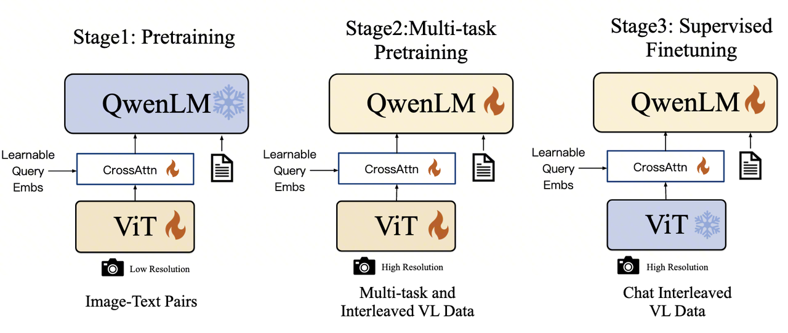
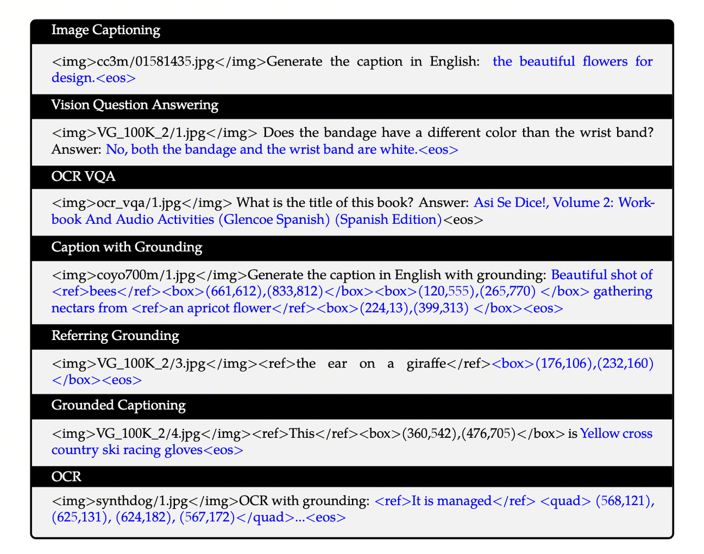
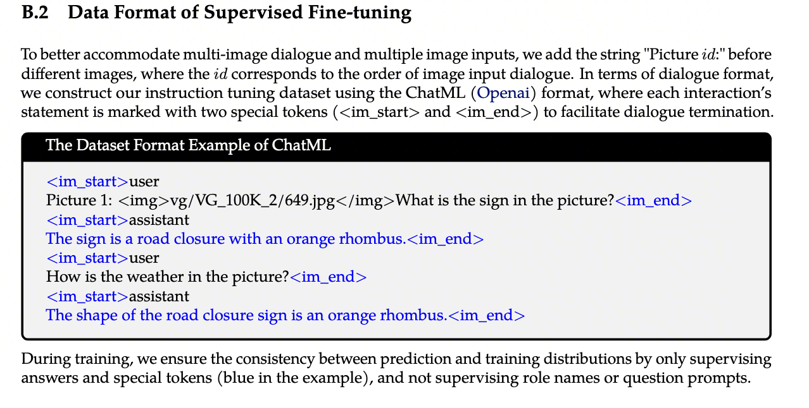
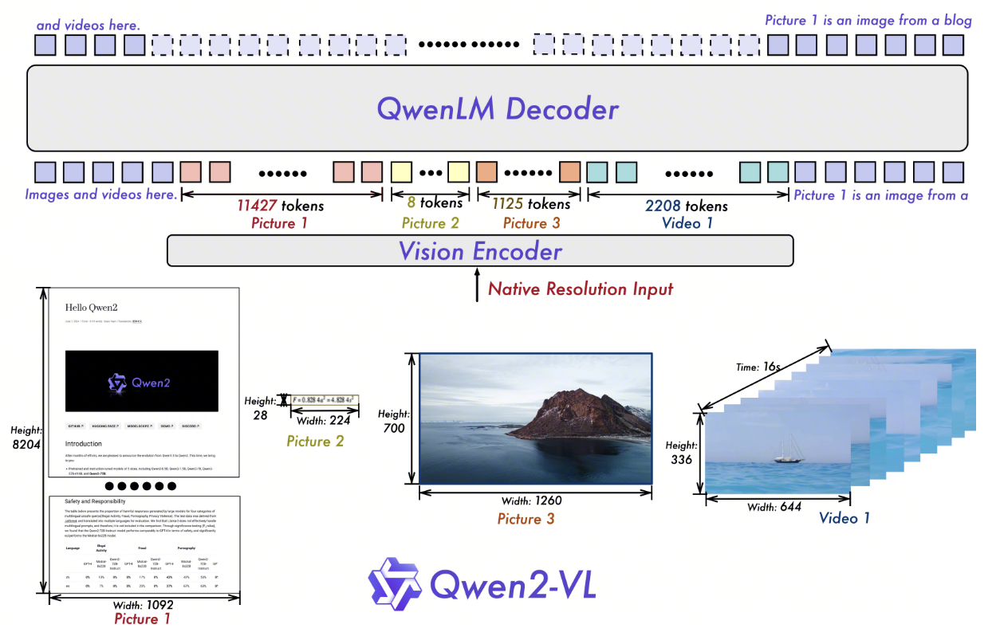
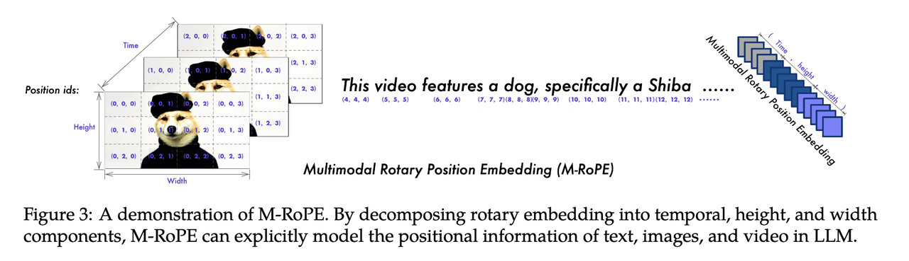
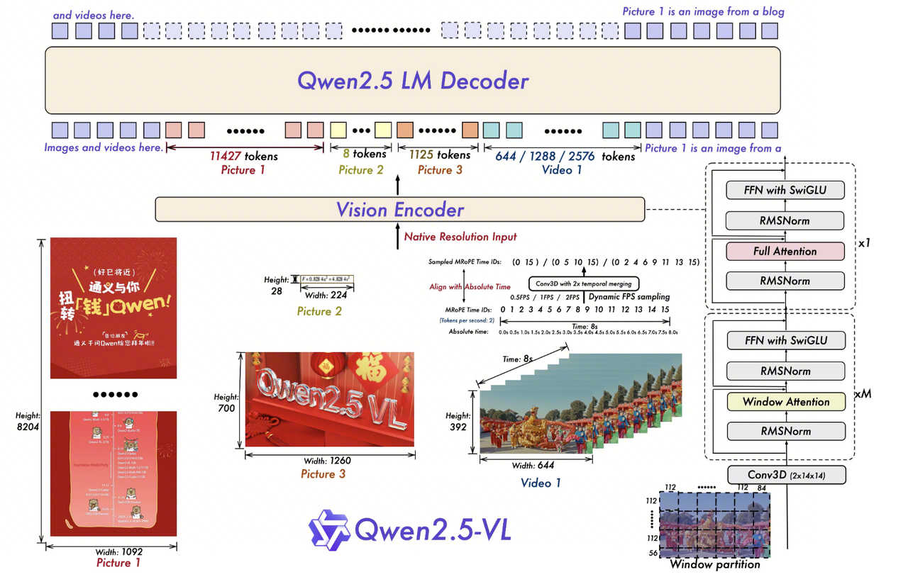
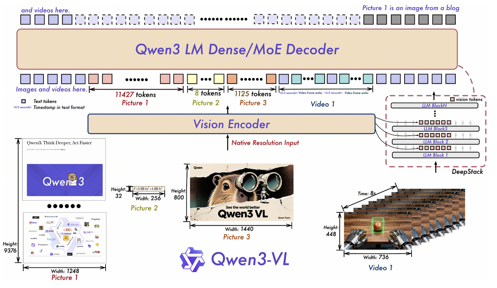

> **TL;DR:**  本文系统梳理了 Qwen-VL 系列四代视觉语言模型的技术演进——从基础的视觉-语言对齐（Qwen-VL），到原生动态分辨率与多模态位置编码（Qwen2-VL），再到工程级推理效率优化（Qwen2.5-VL），最终走向更深层的视觉-语言融合（Qwen3-VL）。

多模态大模型（Multimodal Large Language Models, MLLMs）正在成为 AI 领域最活跃的研究方向之一。在众多视觉语言模型中，阿里巴巴的 Qwen-VL 系列以其清晰的迭代路径和扎实的工程设计备受关注。从 2023 年初代 Qwen-VL 的发布到 2025 年 Qwen3-VL 的亮相，四代模型在架构设计、位置编码方案和训练策略上展现出一条连贯且富有洞见的演进主线。
本文将沿时间线逐一解析每代模型的核心技术贡献。全文结构如下：

| 章节 | 模型 | 核心关键词 |
| :-- | :-- | :-- |
| Part I | [Qwen-VL (2023)](https://arxiv.org/abs/2308.12966) | 三阶段渐进训练、视觉-语言对齐、多任务统一 |
| Part II | [Qwen2-VL (2024)](https://arxiv.org/abs/2409.12191) | M-RoPE、3D卷积、原生动态分辨率 |
| Part III | [Qwen2.5-VL (2025)](https://arxiv.org/abs/2502.13923) | 窗口注意力、动态FPS、拒绝采样与CoT |
| Part IV | [Qwen3-VL (2025)](https://arxiv.org/abs/2511.21631) | Interleaved MRoPE、DeepStack、显式时间戳 |

***

1. # Part I: Qwen-VL —— 奠基之作（2023）
	


Qwen-VL 是整个系列的起点。基于 Qwen-7B 语言模型，它最核心的贡献并非某项单点技术突破，而是建立了一套**三阶段渐进式训练范式**——先对齐（Align）、再增强（Enhance）、后对话（Chat）。这一训练哲学深刻影响了后续所有版本的设计。

1. ## 核心训练思想：渐进式能力构建
	

1. **先对齐 (Align)**：在第一阶段，让模型建立最基础的“图像-文本”映射关系。
	
2. **再增强 (Enhance)**：在第二阶段，通过更复杂、更精细的任务，赋予模型高级技能，如定位、识别文字等。
	
3. **后对话 (Align with Humans)**：在第三阶段，将模型的能力与人类的交互习惯对齐，使其成为一个好用的对话助手。
	

2. ## 阶段一：预训练 (Stage 1: Pre-training)
	

- **🎯 目标**: **建立基础的视觉-语言对齐 (Basic Vision-Language Alignment)**。
	
- **🧱 数据构造 (Data Construction)**:
	- **来源**: 主要使用大规模、噪声较大的网页抓取图文对，如 LAION、DataComp、Coyo 等。论文中提到，经过清洗后使用了约 **14亿** 个图文对。
		
	- **特点**: 数据量巨大，但标签质量参差不齐（“弱标签”）。例如，一张图片可能只配了几个简单的关键词作为描述。
		
	- **格式**: 这是最简单的数据格式。每个训练样本由一张图片和一段对应的文本描述组成。在输入给模型时，格式如下：
		
	  ` [视觉特征序列] </img> [文本描述] <eos>`
	
	-  和 </img>: 特殊标记，用于告诉LLM被包裹在中间的是视觉信息。
		
	- \[视觉特征序列\]: 图片经过视觉编码器和适配器处理后得到的256个向量。
		
	- \[文本描述\]: 与图片配对的文本。
		
	- <eos>: 文本结束标记。
		
	
- **⚙️ 训练方法与目标达成**:
	- **模型状态**: **冻结 (Freeze) 大语言模型 (LLM)**，只训练**视觉编码器 (ViT)** 和 **视觉-语言适配器**。
		
	- **为什么冻结LLM?**:
		- **效率**: 训练整个大模型的成本极高。只训练较小的视觉部分可以大幅提升训练速度。
			
		- **稳定性**: 强大的预训练LLM已经具备了丰富的世界知识和语言能力。如果一开始就用噪声很大的网页数据去训练它，可能会破坏其原有的知识结构。冻结LLM可以保护它不被“污染”。
			
	- **训练任务**: **文本生成 (Text Generation)**。具体来说，是自回归预测。模型在接收到图像特征后，需要逐字预测出对应的文本描述。
		
	- **损失函数**: **交叉熵损失 (Cross-Entropy Loss)**。
		

3. ## 阶段二：多任务预训练 (Stage 2: Multi-task Pre-training)
	



- **🎯 目标**: **注入高级和细粒度的视觉能力 (Injecting Advanced & Fine-grained Skills)**。
	- 在第一阶段的基础上，让模型从“看得懂大概”进化到“看得清细节”。这包括理解物体在图片中的具体位置、识别图片中的文字、理解图表等。
		
- **🧱 数据构造 (Data Construction)**:
	- **来源**: 使用多种高质量、人工标注的数据集，涵盖了7种不同的任务。
		- **黑色文本 (Prefix Sequence without loss)**: 这部分是模型的**输入**或**上下文提示 (Prompt)**。
			
		- **蓝色文本 (Ground Truth Labels with loss)**: 这部分是模型的**学习目标**或**正确答案 (Ground Truth)**。
			
	- **格式**: 针对不同任务，设计了不同的文本格式，核心是**将所有任务都统一为序列到序列的文本生成问题**。
		- **Image Captioning (图像描述)**
			1. **输入 (黑)**: ...</img>Generate the caption in English: (图像 + 生成描述的指令)
				
			2. **目标 (蓝)**: the beautiful flowers for design.<eos> (一句描述性的话)
				
			3. **解读**: 这是最基础的任务。模型学习根据指令为图片生成一句通顺的描述。
				
		- **Vision Question Answering (视觉问答)**
			1. **输入 (黑)**: ...</img>Does the bandage have a different color than the wrist band? Answer: (图像 + 问题)
				
			2. **目标 (蓝)**: No, both the bandage and the wrist band are white.<eos> (问题的答案)
				
			3. **解读**: 模型学习理解关于图像内容的问题，并生成相应的回答。
				
		- **OCR VQA (基于文字的视觉问答)**
			1. **输入 (黑)**: ...</img>What is the title of this book? Answer: (图像 + 关于图中文字的问题)
				
			2. **目标 (蓝)**: Asi Se Dice!, Volume 2: ... (Spanish Edition)<eos> (从图中识别出的文字作为答案)
				
			3. **解读**: 这是VQA的变种，要求模型具备OCR能力，能够“阅读”并理解图片中的文字来回答问题。
				
		- **Caption with Grounding (带定位的描述)**
			1. **输入 (黑)**: ...</img>Generate the caption in English with grounding: (图像 + 生成带定位描述的指令)
				
			2. **目标 (蓝)**: Beautiful shot of <ref>bees</ref><box>(...)</box> gathering nectars from <ref>an apricot flower</ref><box>(...)</box><eos>
				
			3. **解读**: 这是高级能力。模型不仅要生成描述，还要在描述中用特殊标签 <ref>...</ref> 标记出物体，并紧接着用 <box>(坐标)</box> 生成其在图中的边界框坐标。这教会了模型**将语言概念（如“蜜蜂”）和视觉空间位置联系起来**。
				
		- **Referring Grounding (指代定位)**
			1. **输入 (黑)**: ...</img><ref>the ear on a giraffe</ref> (图像 + 一个物体的文字描述)
				
			2. **目标 (蓝)**: <box>(176,106),(232,160)</box><eos> (该物体的边界框坐标)
				
			3. **解读**: 这个任务反了过来。模型接收一个物体的描述，它的任务就是直接生成这个物体的位置坐标。这**直接训练了模型的定位能力**。
				
		- **Grounded Captioning (基于定位的描述)**
			1. **输入 (黑)**: ...</img><ref>This</ref><box>(360,542),(476,705)</box> is (图像 + 一个边界框)
				
			2. **目标 (蓝)**: Yellow cross country ski racing gloves<eos> (对框内物体的描述)
				
			3. **解读**: 这再次反转了任务。模型看到一个特定的区域，需要描述出这个区域里是什么。这**训练了模型对局部图像的细粒度理解能力**。
				
		- **OCR (光学字符识别)**
			1. **输入 (黑)**: ...</img>OCR with grounding: (图像 + OCR指令)
				
			2. **目标 (蓝)**: <ref>It is managed</ref> <quad>(...)</quad>...<eos>
				
			3. **解读**: 类似于带定位的描述，但专门针对文字。模型需要生成识别出的文本，并用 <quad>(四点坐标)</quad> 给出文字的精确位置（使用四边形坐标是为了处理倾斜或透视的文本）。
				
		- **纯文本数据**: 这一阶段也混合了大量的纯文本数据。目的是为了**防止灾难性遗忘 (Catastrophic Forgetting)**，确保模型在学习视觉能力的同时，不会丢失其原有的强大语言能力。
			
- **⚙️ 训练方法与目标达成**:
	- **模型状态**: **解锁 (Unfreeze) 整个模型**。视觉编码器、适配器和LLM**全部参与训练**。
		
	- **为什么全部训练?**: 因为这些高级任务（如定位和推理）需要视觉和语言深度融合。LLM不仅要知道图片里有什么，还需要理解空间关系、文本指令的意图，这要求LLM自身也进行微调，以更好地整合来自适配器的细粒度视觉信息。
		
	- **训练任务**: **统一的文本生成任务**。无论是回答问题、生成坐标还是识别文字，都被模型视为生成一个特定的文本序列。
		
	- **损失函数**: 仍然是**交叉熵损失 (Cross-Entropy Loss)**。
		

***

4. ## 阶段三：监督微调 (Stage 3: Supervised Fine-tuning, SFT)
	

- **🎯 目标**: **对齐人类意图，优化对话能力 (Aligning with Human Intent for Dialogue)**。
	- 让模型从一个强大的“能力集合”转变为一个易于使用的“对话助手”（即Qwen-VL-Chat）。模型需要学会理解指令、遵循对话流程、并以自然、有帮助的方式回答。
		
- **🧱 数据构造 (Data Construction)**:
	- **来源**: 高质量的多模态指令遵循和对话数据集。部分数据由人工编写，部分通过更强大的模型（如GPT-4）辅助生成（即“LLM自指令”）。
		
	- **特点**: 数据形式为多轮对话，可能包含一张或多张图片。
		
	- **格式**: 采用特定的对话格式，如论文中提到的ChatML格式。codeCode
		



- **⚙️ 训练方法与目标达成**:
	- **模型状态**: **再次冻结 (Freeze) 视觉编码器**，只训练**适配器**和**大语言模型 (LLM)**。
		
	- **为什么冻结视觉编码器?**: 经过前两个阶段，视觉编码器已经能够很好地提取图像特征了。这个阶段的重点是调整模型的“行为”和“说话方式”，这是LLM的任务，所以只需要微调语言相关的部分。
		
	- **训练任务与损失函数**: 同样是使用**交叉熵损失**的文本生成任务，但有一个关键区别：在训练期间，我们通过**只监督（计算损失）答案和特殊标记（示例中的蓝色部分）**，而不监督角色名称或问题提示，来确保预测和训练分布的一致性。
		

***

> **Part I 小结：**  Qwen-VL 通过三阶段渐进式训练，首次为 Qwen 系列建立了完整的视觉-语言能力体系。但它也留下了几个关键瓶颈：**固定的图像分辨率**（所有图片都被 resize 到 448×448）限制了细粒度感知，**缺乏原生视频理解能力**，以及**绝对位置编码**在多模态场景下的局限性。这些问题，正是下一代 Qwen2-VL 要着力解决的。

***

2. # Part II: Qwen2-VL —— 原生动态分辨率与多模态位置编码（2024）
	



1. ## 相对于qwen-vl的创新：
	

1. **去除了原始的绝对位置嵌入，并引入了 2D-RoPE，来捕获图像的二维位置信息，支持Native Dynamic Resolution**
	
2. **M-RoPE (Multimodal Rotary Position Embedding)，** 
	
3. **3D 卷积：**  引入深度为 2 的 3D 卷积来处理视频输入，将 2D patches 变为 **3D tubes**。这意味着模型一次可以处理视频中的连续帧，而不是单帧，增强视频理解能力并支持长视频
	
4. **多语言能力的提升**
	

Qwen2-VL 对架构进行了大刀阔斧的改造。它不再满足于在 LLM 前面简单「接」一个视觉编码器，而是从位置编码的底层数学出发，构建了一套真正适配多模态数据的统一坐标体系。这一部分我们将从 RoPE 的基础原理讲起，逐步推导到 Qwen2-VL 的核心创新——M-RoPE。

2. ## M-ROPE
	

**对一个单模态的 patch 进行编码，使其被映射到一个统一的‘多维时空坐标系’中，从而能够与视频、文本等其他模态的数据在同一个空间内进行对齐和交互。** 


1. ### 计算流程
	

- **输入 (Input)**
	- 特征张量 X：形状为 $$(B, L, D)$$。
		
	- 时间索引 $$P\_t$$： $$(B, L)$$。视频帧号（图片/文本设为常数或序列号）。
		
	- 高度索引 $$P\_h$$： $$(B, L)$$。空间行号。
		
	- 宽度索引 $$P\_w$$： $$(B, L)$$。空间列号。
		
- **如何计算 (Calculation)**
	- **三路切分 (Split into 3)**：将 $$$$ 沿 $$$$ 维切成三份：
		
	- $$X\_t = X\[\\dots, 0 : D\_t$$
		
	- $$X\_h = X\[\\dots, D\_t : D\_t+D\_h$$
		
	- $$X\_w = X\[\\dots, D\_t+D\_h : D$$
		
	- **三路并行旋转 (Parallel Rotation)**：
		
	- $$X'\_t = \\text{RoPE}(X\_t, P\_t$$ —— 注入时间信息。
		
	- $$X'\_h = \\text{RoPE}(X\_h, P\_h$$ —— 注入高度信息。
		
	- $$X'\_w = \\text{RoPE}(X\_w, P\_w$$ —— 注入宽度信息。
		
	- **拼接 (Concat)**：
		
	- $$X\_{out} = \\text{Concat}(X'\_t, X'\_h, X'\_w, \\text{dim}=-1$$。
		
- **输出 (Output)**
	- $$X\_{out$$：形状 (B, L, D)。
		
	- 该向量现在是一个“全息”位置载体：
		- 计算 Attention 时，如果在时间上不同（帧不同），$$X'\_t $$部分会产生角度差。
			
		- 如果在空间上不同（像素位置不同），$$X'\_$$和 $$X'\_$$ 部分会产生角度差。
			

2. ### 解决问题
	

**核心场景：**  统一处理 **文本、图像、长视频** 的混合输入。

##### 问题 1：多模态数据的“维度不兼容”

- **痛点**：
	- 文本是 1D 的（只有前后）。
		
	- 图片是 2D 的（有高宽）。
		
	- 视频是 3D 的（有时空）。
		
	- 以前的模型通常需要给每种模态设计不同的编码器，或者暴力地全部压成 1D，导致时空信息混杂，模型难以学习。
		
- **解决**：M-RoPE 建立了一个统一的 $$(t, h, w$$ 三维坐标系。
	- 文本用 $$(i, i, i$$ 模拟 1D。
		
	- 图片用 $$(1, h, w$$ 模拟 2D。
		
	- 视频用 $$(t, h, w$$ 模拟 3D。
		
	- **结果**：所有模态的数据都可以在同一个 Embedding 空间里从容交互，不需要切换编码方式。
		

##### 问题 2：长视频的“索引爆炸”与“外推失败” (The Extrapolation Problem)

- **痛点**：视频产生的 Token 数量极多。
	- 假设一个视频有 1000 帧，每帧 256 个 Token，总 Token 数 = 256,000。
		
	- 如果用 1D 索引，位置号 $$$$ 会一直飙升到 250,000+。
		
	- **RoPE 的弱点**：当推理时的位置索引 $$$$ 远超训练时的最大索引（比如训练时只见过 32k）， $$\\cos(m\\theta$$的旋转角度会变得非常陌生，模型性能急剧下降。
		
- **解决**：M-RoPE 采用了 **“分治策略” (Decomposition)**。
	- 虽然总 Token 有 25万个，但我们把索引拆开了：
		- 时间索引 $$$$ 可能只到 1000。
			
		- 高度索引 $$$$ 可能只到 16。
			
		- 宽度索引 $$$$ 可能只到 16。
			
	- **结果**：每一个分量上的索引数值都非常小（都在模型训练见过的“舒适区”内）。
		
	- **优势**：这让模型能够理解比训练时长得多的视频（因为 $$$$ 增加只会导致时间分量的旋转，而不会破坏空间分量的感知），实现了强大的长距离外推能力。
		

3. ### 3D卷积--**时空降采样 (Temporal Downsampling)** 模块
	

1. #### 目的
	

核心目的是 **压缩 Token 数量，提升计算效率**。

- **无损压缩**：视频中相邻的两帧通常非常相似（比如背景不动，只有人在动）。如果每一帧都独立编码，会有大量的信息冗余。
	
- **减半序列长度**：通过 3D 卷积，模型将 **2 个时间帧** 融合成 **1 个特征向量（Token）**。
	- **结果**：在同样的 Token 预算（显存限制）下，Qwen2-VL 可以读取 **2倍时长** 的视频。或者说，处理同样时长的视频，它的计算量减少了一半
		

2. #### 实现
	

- **传统 ViT (2D 处理)**：处理视频时，通常是一帧一帧处理。每帧图片被切成 $$14 \\times 1$$ 的小方块（Patches）。
	- 第 1 帧 -> 产生 N 个 Token。
		
	- 第 2 帧 -> 产生 N 个 Token。
		
	- 总 Token 数 = 帧数 $$\\time$$ N。
		
- **Qwen2-VL 的 3D 卷积 (3D 处理)**：它使用了一个 **深度为 2 (Depth = 2)** 的 3D 卷积核。这意味着它一次性“吞掉”时间上相邻的**两帧**画面。它不再提取平面的 Patch，而是提取立体的 “3D Tube” (时空管)。这个 Tube 的维度是：这个 Tube 的维度是：2帧t$$\\time$$ 14h $$\\time$$ 14w
	

3. ## 训练
	

1. ### 核心训练原则
	

- **训练目标**：Next-Token Prediction（下一词预测）。
	
- **损失计算 (Loss)**：仅计算**文本 Token** 的交叉熵损失，**视觉 Token** 被 Mask 掉（权重为0）。
	
- **初始化**：
	- **LLM**：使用 Qwen2 (1.5B/7B/72B) 初始化。
		
	- **ViT**：初始化自 DFN，但去掉了绝对位置编码，改为 **2D-RoPE**。
		

1. #### 第一阶段：视觉编码器预训练 (ViT Training)
	

- **目标**：让视觉编码器（ViT）学会“看图”，并与 LLM 的语义空间对齐。
	
- **参数状态**：
	- **训练**：ViT + Adapter。
		
	- **冻结**：LLM。
		
- **数据**：600B tokens，大规模弱标注的**图像-文本对**。
	
- **关键点**：ViT 开始适应 2D-RoPE 机制。
	

2. #### 第二阶段：全参数预训练 (Full Parameter Pre-training)
	

- **目标**：提升细粒度视觉感知（如 OCR、图表）及视频理解能力。
	
- **参数状态**：**全参数解冻**（ViT + LLM + Adapter 全部参与训练）。
	
- **数据**：800B tokens（累计 1.4T）。
	- 类型丰富：混合图文、OCR 数据、交错图文文章、**视频数据**。
		
	- 混入纯文本数据以维持语言能力。
		
- **关键机制启用**：
	- **Naive Dynamic Resolution**：输入任意分辨率图片。
		
	- **M-RoPE**：统一处理图/文/视频位置信息。
		
	- **3D 卷积**：将图片复制为两帧，或将视频两帧压为一组，统一输入接口。
		

3. #### 第三阶段：指令微调 (Instruction Fine-tuning)
	

- **目标**：对齐人类意图，获得对话、指令遵循及 Agent 能力。
	
- **参数状态**：
	- **冻结**：ViT（认为感知能力已足够）。
		
	- **训练**：LLM。
		
- **数据**：**ChatML 格式**对话数据。
	- 包含：多模态对话、长视频问答、Agent 操作序列、纯文本指令。
		
- **Loss 特性**：进一步 Mask 掉 `<|im_start|>user` 部分，**仅计算 Assistant 回复的 Loss**。
	

***

> **Part II 小结：**  Qwen2-VL 实现了从初代到真正多模态原生模型的跨越——M-RoPE 统一了文本、图像、视频的位置编码体系，3D 卷积将视频处理效率提升了一倍，原生动态分辨率让模型彻底摆脱了固定尺寸的束缚。然而，随着输入分辨率的提升，ViT 全局注意力的二次复杂度成为新的瓶颈，同时模型在长视频场景下的时间感知仍依赖相对帧索引，缺乏对真实物理时间的理解。

***

3. # Part III: Qwen2.5-VL —— 工程优化与训练范式的全面升级（2025）
	

1. ## 相对于Qwen2-VL的核心创新
	

- 窗口注意力机制，以优化推理效率
	
- 动态FPS采样，将动态分辨率扩展到时间维度，从而能够全面理解各种采样率下的视频
	
- 通过与绝对时间对齐，升级了时间域中的MRoPE，从而促进了更复杂的时间序列学习
	



2. ## 窗口注意力机制 (Window Attention)
	

为了解决高分辨率图像处理中计算复杂度爆炸的问题。传统 ViT 的全局注意力复杂度是 $$O(N^2$$，而窗口注意力将其降低为 $$O(N$$（线性）。

1. ### **实现原理与计算流程**
	

**Step 1: 动态分辨率输入与切片 (Patching)**

- **输入：**  假设输入图像为 $$H \\times $$。Qwen2.5-VL 强制将 $$H, $$ resize 为 28 的倍数。
	
- **切片：**  Patch Size 为 $$14 \\times 1$$。
	
- **Token 数量：**  总 Token 数 $$L = (H/14) \\times (W/14$$。
	
- **维度变化：**  输入 $$(1, 3, H, W) \\rightarro$$ $$Flatten Patch \\rightarrow (1, L, D$$，其中 $$$$ 是 Hidden Size (如 1280)。**Step 2: 窗口划分 (Window Partitioning)**
	
- **参数含义：** 
	- **Window Size (像素级):**  $$112 \\times 11$$。
		
	- **Window Size (Patch级):**  $$112 / 14 = $$。即每个窗口包含 $$8 \\times 8 = 6$$ 个 Patch。
		
- **逻辑：**  将整张图的 Token 矩阵切分成多个不重叠的窗口。
	
- **计算：** 窗口数量 $$N\_{win} = \\frac{L}{8 \\times 8} = \\frac{L}{64$$。
	
- **维度变化：** $$(1, L, D) \\rightarrow (N\_{win}, 64, D$$。\*注意：原来的 Batch Size 1 变成了 N\_{win}，相当于把每个窗口当作一个独立的“小图片”并行处理。
	

**Step 3:** **局部注意力计算 (Local Attention)**

- **推理：**  在每个 $$64 \\times $$ 的窗口内部计算 Self-Attention。
	

$$\\text{Attention}(Q, K, V) = \\text{Softmax}(\\frac{QK^T}{\\sqrt{d\_k}})$$

- **复杂度：**  $$N\_{win} \\times (64)^$$。因为 $$N\_{win$$ 与 $$$$ 成正比，所以整体复杂度随图像面积线性增长，不再是指数级。
	

**Step 4: 全局信息交互 (Global Interaction)**

- 如果只做窗口注意力，窗口之间无法传递信息。
	
- **实现：**  Qwen2.5-VL 在特定的层（索引为 {7, 15, 23, 31} 的层）保留了全注意力 (Full Self-Attention)。
	
- **作用：**  在这些层，不做窗口划分，让全图 Token 交互，打通全局语义。
	

3. ## 动态FPS采样 (Dynamic FPS Sampling)
	

为了让模型能够原生处理视频的时间维度，而不受固定帧率的束缚。

1. ### **实现原理与计算流程**
	

**Step 1: 3D Tube 处理单元**

- **参数含义：** 
	- **空间 Patch:**  $$14 \\times 1$$。
		
	- **时间 Stride:**  2（即每 2 帧聚合一次）。
		
- **实现：**  以前处理图片是 2D Patch，现在处理视频是 3D Tube。
	
- **计算：**  取视频中连续的 2 帧，在相同空间位置切出的 Patch 组合成一个 Token。
	
- **维度变化：** 
	- 假设视频采样了 $$$$ 帧，分辨率 $$H \\times $$。
		
	- 总 Patch 数并不是 $$T \\times (H/14) \\times (W/14$$。
		
	- 而是 $$\\frac{T}{2} \\times (H/14) \\times (W/14$$。
		
- **意义：**  Token 数量减半，计算效率提升一倍，且单个 Token 包含了短时间（2帧）内的动态变化信息。
	

**Step 2: 动态采样策略**

- **推理：**  模型不强制要求固定的 FPS（如必须 1fps）。它可以接受 0.5fps 的慢节奏视频，也可以接受 2fps 的快节奏视频。
	
- **实现：**  将采样到的帧序列视为一个长序列输入，结合下文提到的“绝对时间编码”来告知模型每两帧之间的时间跨度
	

4. ## 绝对时间 MRoPE (Multimodal Rotary Position Embedding with Absolute Time)
	

#### **背景：Qwen2-VL 的相对做法 vs Qwen2.5-VL 的绝对做法**

- **Qwen2-VL (旧版):**  给帧打标签为 Frame ID: 0, 1, 2...
	- 问题： Frame 1 到 Frame 2 是过了 0.1秒还是 10秒？模型不知道。
		
- **Qwen2.5-VL (新版):**  Frame ID 直接映射到绝对时间戳。
	

1. ### **实现原理与计算流程**
	

**Step 1: 位置编码分解 (Decomposition)**
MRoPE 将位置编码分为三个正交的部分：

1. **Temporal (时间):**  $$ID\_$$
	
2. **Height (高度):**  $$ID\_$$
	
3. **Width (宽度):**  $$ID\_$$
	

**Step 2: 绝对时间对齐 (Alignment)**
对于第 $$$$ 帧，其时间位置 ID 不是简单的 k，而是：$$ID\_{t} = \\text{Round}(t\_{abs} \\times v$$，其中
$$t\_{abs$$: 某一帧在视频中的真实时间（秒），$$$$: 帧率（例如每秒对应多少个 ID 单位）。

- 示例： $$v=2$$
	- 帧1 (0.0s): $$ID\_t = $$
		
	- 帧2 (0.5s): $$ID\_t = 1$$
		
	- 帧3 (2.0s): $$ID\_t = 4$$
		
- **推理差异：**  在传统的 Transformer 中，位置 ID 通常是连续的 $$(0, 1, 2$$。但在 Qwen2.5-VL 处理视频时， $$ID\_$$ 序列可能是跳跃的 $$(0, 12, 48$$。
	

**Step 3: 旋转应用 (Rotation)**

- 在 Attention 计算 $$Q, $$ 时，分别对特征向量的不同部分应用旋转：
	- 向量的前一部分应用 $$ID\_$$ 的旋转矩阵。
		
	- 中间部分应用 $$ID\_$$ 的旋转矩阵。
		
	- 后一部分应用 $$ID\_$$ 的旋转矩阵。
		
- **推理效果：**  当计算 Attention Score $$QK^$$ 时，由于 RoPE 的相对位置特性，模型感知到的“距离”直接对应物理世界的“时间差”。
	- 帧1和帧2的距离 $$\\Delta = 1$$。
		
	- 帧2和帧3的距离 $$\\Delta = 3$$。
		
	- 模型因此“知道”帧2到帧3的时间跨度比帧1到帧2长得多，从而理解了视频的节奏（Tempo）。
		

5. ## **总结：三者如何协同工作？**
	

1. **输入端：**  视频被切分为 2 帧一组的 3D Tubes（动态FPS采样）。
	
2. **位置编码：**  每个 Tube 根据其代表的真实秒数，被赋予跳跃的、真实的 绝对时间 ID（MRoPE）。
	
3. **编码器：**  这些 Token 进入 ViT，在大部分层中只在 $$8 \\times $$ 的 窗口内计算注意力（Window Attention），极低成本地提取特征，只在少数几层进行全局时空信息融合。
	

6. ## **与Swin Transformer “移动窗口（Shifted Window）”注意力的不同**
	

1. ### 核心区别：信息的“跨窗口”交互方式
	

- **Swin Transformer 的方式 (Shifted Window):** 
	- 为了让不同窗口之间的信息能够交流，Swin 采用交替策略：第 $$$$ 层使用标准窗口，第 $$l+$$ 层使用移动窗口（Shifted Window）。
		
	- 通过移动窗口的重叠部分，信息在下一层传播到相邻窗口。它从未真正进行过全图的 Full Attention。
		
- **Qwen2.5-VL 的方式 (Interleaved Full Attention):** 
	- 它**不使用移动窗口**。它的窗口在大部分层是固定的（不重叠，不移动）。
		
	- 为了解决“窗口之间信息不互通”的问题，它**每隔几层插入一个全全局注意力（Full Self-Attention）层**。
		
	- **机制：**  在窗口层提取局部细节，在全注意力层进行一次彻底的全局信息交换。
		

2. ### 为什么不选 Swin 的 Shifted Window？
	

Qwen2.5-VL比 Swin 更适合Native Dynamic Resolution

1. **动态分辨率的适配性：** 
	1. Swin Transformer 的 Shifted Window 在处理固定尺寸图片时很有效，但 Qwen2.5-VL 强调 **Native Dynamic Resolution（原生动态分辨率）**，输入图片的宽高比千变万化。
		
	2. 在动态分辨率下实现“移动窗口”需要极其复杂的 Padding（填充）和 Masking（掩码）操作，尤其是当图片边缘切分不整齐时，计算效率会大打折扣。
		
	3. 相比之下，**固定窗口 + 稀疏的全注意力层** 实现起来更简单、高效，且利用 FlashAttention 等加速算子，那几个全注意力层的开销是完全可控的。
		
2. **计算复杂度控制：** 
	1. 报告提到：“Only four layers employ full self-attention... computational cost scales linearly...”（只有四层使用全注意力...计算成本呈线性增长）。
		
	2. 这种设计在保留了 ViT 全局建模能力的“上限”（通过那4层全关注层）的同时，将整体 FLOPs 压低到了接近 Swin 的水平。
		

7. ## 训练
	

Qwen2.5-VL 的训练过程是一个从“视觉感知”到“多模态理解”再到“指令遵循与对齐”的递进过程。整个流程分为 **预训练（Pre-training）** 和 **后训练（Post-training）** 两大板块，共计 5 个关键阶段。

1. ### 预训练 (Pre-Training)
	

**目标：**  让模型学会“看”世界，并建立视觉与语言的基础连接。
**数据规模：**  从上一代的 1.2T 扩展到了 **4.1T tokens**。

#### **阶段 1：ViT 初始对齐 (Visual Encoder Initialization)**

- **训练对象：**  **只训练 Vision Transformer (ViT)**，LLM 部分不参与或被冻结。
	
- **任务目标：**  让重头设计（从零训练）的 ViT 具备将像素转化为语义特征的能力，并初步与语言空间对齐。
	
- **训练数据：** 
	- 大量的基础图文对（Image-Caption）。
		
	- 视觉知识数据（如百科图片）。
		
	- OCR 数据（文字识别）。
		
- **关键点：**  这是为了让 ViT 在进入复杂任务前，先学会提取“有意义”的视觉特征。
	

#### **阶段 2：全参数多模态预训练 (Multimodal Pre-Training)**

- **训练对象：**  **解冻所有参数**（ViT + LLM 全量训练）。
	
- **任务目标：**  建立视觉特征与语言逻辑的深度连接，让 LLM 真正理解 ViT 传进来的东西是什么。
	
- **训练数据：**  数据变得更复杂、逻辑性更强。
	- **图文交错数据 (Interleaved Image-Text):**  类似网页截图或教材，图片和文字穿插出现，学习上下文关联。
		
	- **视觉问答 (VQA):**  一问一答。
		
	- **多任务学习数据:**  包括数学、代码等。
		
	- **纯文本数据:**  保持 LLM 的语言能力不退化。
		
- **序列长度：**  此时上下文长度限制在 **8,192 (8k)**。
	

#### **阶段 3：长上下文与高分辨率强化 (Long-Context Pre-Training)**

- **训练对象：**  全量训练 (ViT + LLM)。
	
- **任务目标：**  解决“看不全”和“记不住”的问题，专门提升处理高分辨率大图、长视频和复杂推理的能力。
	
- **关键变化：**  **序列长度从 8k 扩展到 32,768 (32k)**。
	
- **训练数据：** 
	- **长视频 (Long Video):**  需要跨度很大的时间记忆。
		
	- **Agent 数据:**  多步操作的轨迹。
		
	- **高分辨率文档:**  需要细致的细节识别。
		
- **技术细节：**  为了解决不同图片尺寸导致的计算负载不均衡，使用了动态打包 (Dynamic Packing) 技术，将不同长度的数据拼在一起塞进 GPU，保证计算效率。
	

2. ### 第二板块：后训练 (Post-Training)
	

**目标：**  让模型学会“听懂指令”，并符合人类的偏好（有用、无害）。

#### **阶段 4：监督微调 (Supervised Fine-Tuning, SFT)**

- **训练对象：**  **冻结 ViT，只微调 LLM**。
	- *原因：*  经过预训练，ViT 的感知能力已经足够强，此时重点是教 LLM 如何根据视觉信息回答人类的特定指令。
		
- **数据格式：**  ChatML 格式（User/Assistant 对话），显式注入视觉 Embedding。
	
- **数据量与构成：**  约 **200万 (2M)** 条数据。
	- 50% 纯文本对话（保持语言能力）。
		
	- 50% 多模态对话（图文、视频文）。
		
- **关键技术：数据过滤与增强**
	- **自动化过滤：**  使用基于规则的方法（去除重复、破损数据）和基于模型的方法（用一个 72B 的模型给数据打分，剔除图文不相关的低质量数据）。
		
	- **拒绝采样 (Rejection Sampling):**  针对数学、代码等硬核推理任务。让模型生成多个答案，用 Ground Truth 验证，把答对且推理过程清晰的样本保留下来作为训练数据。这能显著增强**思维链 (CoT)** 能力。
		

#### **阶段 5：直接偏好优化 (Direct Preference Optimization, DPO)**

- **训练对象：**  **冻结 ViT，优化 LLM**。
	
- **任务目标：**  对齐人类价值观，减少幻觉，提升安全性。
	
- **训练数据：**  偏好对数据（Preference Pairs）。
	- 即：给模型同一个问题，提供两个回答（一个好 $$ y\_w$$，一个差 $$y\_l$$），训练模型以此为目标优化。
		
- **策略：**  仅针对图像-文本和纯文本数据进行 DPO。
	

3. ### 拒绝采样
	

简单来说，它的核心逻辑是：“广撒网，优中选优，以战养战”。通常我们也把它称为 **Best-of-N** 策略。

1. #### 通俗易懂的比喻
	

想象你要教一个学生（模型）解高难度的奥数题：

- **普通教学 (SFT):**  你直接把标准答案抄给他看，让他背下来。
	- *缺点：*  学生可能只记住了答案，没学会中间的推理逻辑。
		
- **拒绝采样 (Rejection Sampling):** 
	- 你让学生自己试着做这道题，允许他做100 遍，每次尝试不同的解题思路。
		
	- 你拿着标准答案（Ground Truth）去批改。
		
	- 其中 95 次都做错了，你直接拒绝（Reject） / 扔掉。
		
	- 有 5 次做对了，而且步骤写得很清楚。
		
	- 你把这 5 个“通过自己思考做对的完美步骤”整理出来，作为新的教材，让他重新学习。
		

2. #### Qwen2.5-VL 中具体的实施步骤
	

在论文中，这个过程主要针对 **数学问题**、**代码生成** 和 **领域特定的 VQA** 任务。
**Step 1: 生成 (Generation)**

- 使用一个中间版本的 Qwen2.5-VL 模型。
	
- 针对同一个问题（Prompt），让模型生成 $$$$ 个不同的回答。
	
- 利用**思维链 (Chain-of-Thought, CoT)** 技术，强制模型一步步写出推理过程。
	

**Step 2: 验证与筛选 (Verification & Rejection)**
这是最关键的一步，如何判断这 $$$$ 个回答哪个是好的？

- **硬性标准（答案正确性）：**  拿 Ground Truth（标准答案）去比对。
	- 比如数学题答案是 "42"，那么生成内容最后得出的也是 "42" 的保留，得不出 "42" 的统统**拒绝 (Reject)**。
		
	- 代码题则运行一下代码，看能不能跑通测试用例。
		
- **软性标准（质量过滤）：**  论文中提到，即使答案对了，有些回答质量也很差，需要过滤：
	- **Code-switching:**  比如中英文夹杂得很乱的，拒绝。
		
	- **Repetitive patterns:**  像复读机一样重复一句话的，拒绝。
		
	- **Excessive length:**  废话连篇太长的，拒绝。
		

**Step 3: 构造数据集 (Dataset Construction)**

- 把经过筛选后留下的那些**高质量、带推理过程、且答案正确**的样本，加入到 SFT 的训练数据集中。
	

**Step 4: 微调 (Fine-Tuning)**

- 用这些“精选”出来的数据去微调模型。
	

3. #### 解决了两个痛点：
	

**1\. 标准答案通常太简略，缺乏“思维链”**

- **数据现状：**  很多数据集（如数学题库）只有 Question 和 Final Answer，没有中间的 step-by-step 推理过程。
	
- **拒绝采样的作用：**  强迫模型自己把中间过程补全，并且通过答案验证来确保补全的过程是对的。这就**自动生产了昂贵的 CoT 数据**。
	

**2\. 消除“分布偏移” (Distribution Shift)**

- **问题：**  人类写的标准推理过程，有时候过于跳跃，或者用词习惯模型并不熟悉。模型“死记硬背”会很难受。
	
- **拒绝采样的作用：**  既然是模型自己生成的（Self-generated），那么其语言风格、推理节奏完全符合模型自身的概率分布。模型学习“自己生成的高质量数据”比学习“人类写的数据”效率更高，效果更好。
	

4. #### CoT产生及其过滤
	

##### 如何“强制”模型一步步写出推理过程？

依靠Prompt Engineering（提示工程）和Few-Shot Prompting（少样本提示）。

1. 系统级指令 (System Prompting)在输入给模型的 Prompt 中，强行加入要求推理的指令。
	1. **普通指令：**  “图片里有几只猫？”
		
	2. **CoT 诱导指令：**  “请仔细观察图片，**逐步思考（Think step-by-step）**。首先，检测图片中所有的动物；其次，分辨哪些是猫；最后，数出猫的数量并给出最终答案。”
		
2. 格式约束 (Format Enforcement)为了方便后续提取和清洗，通常会要求模型按照特定格式输出。**示例格式：** 
	

```Markdown
<thinking>
第一步：识别图像左上角，发现一个红色物体...
第二步：根据形状判断这是一个苹果...
...
</thinking>
<answer>
这是一个苹果
</answer>
```

**实现：**  如果模型不按这个格式输出，程序可以直接报错并要求重试，或者在预训练微调阶段就让模型见过大量这种格式的数据。

- 少样本示范 (Few-Shot Demonstration)。**Prompt 内容：** 
	

> \> **问题：**  图中的三角形面积是多少？
> \> **回答：**  首先，我看到底边长为4，高为3。根据三角形面积公式 1/2\*底\*高... 计算得出 1/2\*4\*3=6。答案是6。
> \>
> \> **问题（当前任务）：**  图中的圆形面积是多少？
> \> **回答：**  ... (模型会模仿上面的语气和步骤开始写)

##### 如何通过“软性标准”判断 CoT 的质量？

###### 基于规则的过滤 (Rule-Based Filtering)

这些是写死在代码里的硬规则，用来快速剔除明显的垃圾数据。论文中明确提到的标准包括：

- **代码混用 (Code-switching):** 
	- *烂 CoT：*  "First, 我们需要 calculate the area..."（中英文频繁无意义切换，语序混乱）。
		
	- *判断：*  检测句子中语言种类的切换频率，太高则丢弃。
		
- **重复模式 (Repetitive patterns):** 
	- *烂 CoT：*  "因此我们得到3，因此我们得到3，因此我们得到3..."
		
	- *判断：*  使用 n-gram 算法检测文本重复率。
		
- **过度冗长 (Excessive length):** 
	- *烂 CoT：*  一个简单的加法写了 5000 字的废话。
		
	- *判断：*  设置 Token 长度阈值，或者计算“信息密度”。
		
- **格式错误:**  没有按照 `<thinking>` 标签闭合的，直接丢弃。
	

###### 基于模型的过滤 (Model-Based Filtering) —— 查“逻辑分”

规则查不出逻辑漏洞，这时候需要用一个更强的模型（或同等级模型）作为“判卷老师”（Reward Model 或 Verifier）。Qwen2.5-VL 使用了自己的 72B 版本或专门训练的 Reward Model 来给生成的 CoT 打分。打分维度通常包括：

- **视觉-文本一致性 (Visual-Text Alignment):**  **(这是 VLM 特有的)**
	- *烂 CoT：*  "因为图片左上角有一只**蓝色的狗**..."（实际上图里是一只红色的猫）。
		
	- *判断：*  判卷模型会同时看图和文字，发现文字描述与图片事实不符（幻觉），直接打低分剔除。这是最关键的一点，防止模型瞎编乱造。
		
- **逻辑连贯性 (Logical Coherence):** 
	- *烂 CoT：*  "因为 1+1=2，所以天空是蓝色的。"（前后步骤没有因果关系）。
		
	- *判断：*  判卷模型评估 Step A 能否推导出 Step B。
		
- **有用性与安全性 (Helpfulness & Safety):** 
	- 确保推理过程没有包含有害信息或绕弯子。
		

***

> **Part III 小结：**  Qwen2.5-VL 完成了一次全方位的工程升级：窗口注意力将 ViT 的计算复杂度从二次降为线性，动态 FPS 采样让时间维度实现了原生动态处理，绝对时间 MRoPE 赋予了模型真实的时间感知能力。在训练层面，拒绝采样机制大幅提升了推理数据质量和模型的 CoT 能力。Qwen3-VL 则在此基础上进一步探索更深层的视觉-语言融合机制。

***

4. # Part IV: Qwen3-VL —— 走向更深层的视觉-语言融合（2025）
	

Qwen3-VL 不再仅仅满足于将视觉特征拼接到语言模型的输入端，而是让视觉信息真正的流入到 LLM 的每一层计算中。它的三项核心创新分别解决了位置编码、视觉融合深度和时间感知三个维度的问题。


1. ## 核心架构创新
	

1. ### Interleaved MRoPE（交错式多维旋转位置编码）
	

- **Qwen2.5-VL的做法：**  使用标准的MRoPE。它将位置嵌入维度分块（chunking），分别分配给时间（t）、高度（h）和宽度（w）。
	
- **存在的问题：**  这种分块方式会导致**频谱不平衡（Imbalanced frequency spectrum）**。即某些空间或时间维度只能接触到特定的频率范围，这会损害模型对长视频的理解能力。
	
- **Qwen3-VL的创新：**  采用**Interleaved MRoPE**。
	- **方法：**  不再简单分块，而是将时间、高度、宽度的分量\*\*交错（Interleave）\*\*分布在整个嵌入维度中。
		
	- **解决的问题：**  确保了每个时空轴（t, h, w）都能均匀地覆盖低频和高频波段。这显著提升了模型在**长视频理解**和精细空间建模上的表现。
		

2. ### DeepStack（深层视觉融合机制）
	

- **Qwen2.5-VL的做法：**  传统的视觉-语言对齐通常只使用Vision Transformer (ViT) 最后一层的输出，或者通过简单的MLP投影连接到LLM。
	
- **存在的问题：**  ViT的深层特征虽然语义丰富，但往往丢失了底层的细粒度视觉信息（如纹理、微小物体）。单层融合导致视觉信息损失。
	
- **Qwen3-VL的创新：**  引入**DeepStack**机制（受Meng et al., 2024启发）。
	- **方法：**  从Vision Encoder（SigLIP-2）的**不同层级（低层到高层）提取视觉Token。这些多层级的Token经过投影后，通过残差连接直接注入到LLM的前三层**中。
		
	- **解决的问题：**  **收紧了视觉与语言的对齐（Tighter alignment）**。模型既能获得高层语义，又能保留低层视觉细节，且**不增加额外的上下文长度**（因为是并行注入而非串行拼接）。
		

3. ### Explicit Video Timestamp（显式文本时间戳）
	

- **Qwen2.5-VL的做法：**  使用基于绝对时间的**位置编码**（Time-synchronized MRoPE）来表示时间。
	
- **存在的问题：** 
	- 对于长视频，产生的位置ID非常大且稀疏，导致模型难以理解长跨度的时间上下文。
		
	- 数据构建成本高，需要均匀采样帧率。
		
- **Qwen3-VL的创新：**  采用**基于文本的显式时间戳（Textual token-based time encoding）**。
	- \*\*方法：\*\*使用长度自适应采样 (Length-Adaptive Sampling)，并直接在视频帧组前插入文本格式的时间戳Token（例如 `<3.0 seconds>`）。训练时混合使用秒数和HMS（时:分:秒）格式，**秒格式：**  `"<125.5 seconds>` **HMS格式：**  `"<00:02:05>"`
		
	- **解决的问题：**  提供了更直接、更精确的时间感知能力，大幅提升了视频定位（Video Grounding）和密集描述（Dense Captioning）的能力，同时降低了对采样率的敏感度。
		

***

5. # 总结与展望
	

1. ## 四代模型的技术演进脉络
	

回顾 Qwen-VL 系列的四代演进，可以清晰地看到一条从**能看**到**看得好**再到**看得快且深**的技术主线：

| 维度 | Qwen-VL (2023) | Qwen2-VL (2024) | Qwen2.5-VL (2025) | Qwen3-VL (2025) |
| :-- | :-- | :-- | :-- | :-- |
| **视觉编码器** | ViT + 固定分辨率 | ViT + 原生动态分辨率 | ViT + 窗口注意力 | SigLIP-2 + DeepStack |
| **位置编码** | 绝对位置编码 | M-RoPE (分块式) | M-RoPE + 绝对时间 | Interleaved MRoPE |
| **视频处理** | 不支持 | 3D卷积时空降采样 | 动态FPS采样 | 显式文本时间戳 |
| **训练范式** | 三阶段渐进训练 | 三阶段（ViT→全参→SFT） | 五阶段（+长上下文+DPO） | 延续并深化 |
| **核心突破** | 建立基础范式 | 多模态统一位置编码 | 工程效率与数据质量 | 深层视觉融合 |

2. ## 关键设计哲学
	

纵观整个系列，有几条贯穿始终的设计哲学值得特别关注：

1. **渐进式训练的稳定性优先**：每一代都严格遵循「先冻结后解冻」的训练策略，确保每个模块在被联合训练之前已经具备足够的基础能力。
	
2. **统一的序列化范式**：无论是定位坐标、OCR文本还是视频时间戳，所有信息都被统一表示为文本序列，充分利用了 LLM 的序列建模能力。
	
3. **从相对到绝对的时间感知**：时间编码经历了「无时间→相对帧索引→绝对时间位置编码→显式文本时间戳」的演进，每一步都让模型对时间的理解更加直接和精确。
	
4. **数据质量驱动的能力提升**：从简单的图文对到拒绝采样生成的 CoT 数据，数据工程的精细化程度与模型能力的提升高度正相关。
	

3. ## 展望
	

Qwen-VL 系列的演进为我们提供了一个观察多模态大模型发展趋势的绝佳窗口。从 Qwen3-VL 的 DeepStack 机制可以看到，未来的方向正在从「在 LLM 前面接一个视觉编码器」转向「让视觉信息深度参与语言模型的每一层计算」。随着视觉与语言的融合越来越深入，多模态模型与纯语言模型之间的界限也将越来越模糊。
期待 Qwen-VL 系列的下一步演进。

***

<br>

6. # 延伸阅读
	

如果你对本文涉及的技术细节感兴趣，以下论文值得进一步阅读：
**视觉****编码器****基础**

- [An Image is Worth 16x16 Words: Transformers for Image Recognition at Scale](https://arxiv.org/abs/2010.11929) (ViT, Dosovitskiy et al., 2020) —— Qwen-VL 全系列所依赖的视觉编码器骨干，开创了将 Transformer 直接应用于图像 patch 序列的范式。
	
- [Swin Transformer: Hierarchical Vision Transformer using Shifted Windows](https://arxiv.org/abs/2103.14030) (Liu et al., 2021) —— 文中讨论 Qwen2.5-VL 窗口注意力时的重要对比对象，其 Shifted Window 机制与 Qwen2.5-VL 的 2D-RoPE 窗口注意力形成有趣对照。
	
- [Sigmoid Loss for Language Image Pre-Training](https://arxiv.org/abs/2303.15343) (SigLIP, Zhai et al., 2023) —— Qwen3-VL 将视觉编码器从 ViT 切换为 SigLIP-2，SigLIP 用 sigmoid 损失替代 softmax 对比损失，在效率和性能上带来显著提升。
	

**位置编码****与****序列建模**

- [RoFormer: Enhanced Transformer with Rotary Position Embedding](https://arxiv.org/abs/2104.09864) (Su et al., 2021) —— M-RoPE 的理论基础，旋转位置编码（RoPE）已成为现代大模型的标准组件，Qwen-VL 系列将其创造性地扩展到多模态场景。
	
- [ViViT: A Video Vision Transformer](https://arxiv.org/abs/2103.15691) (Arnab et al., 2021) —— 理解 Qwen2-VL 3D 卷积时间降采样设计的重要参考，探索了将 ViT 扩展到视频理解的多种架构方案。
	

**视觉-语言融合架构**

- [Flamingo: a Visual Language Model for Few-Shot Learning](https://arxiv.org/abs/2204.14198) (Alayrac et al., 2022) —— 多模态大模型的里程碑工作，其 cross-attention 融合机制是理解 Qwen3-VL DeepStack 深层视觉融合的重要背景。
	
- [DeepStack: Deeply Stacking Visual Tokens is Surprisingly Simple and Effective for LMMs](https://arxiv.org/abs/2406.04334) (Meng et al., 2024) —— Qwen3-VL 核心创新之一，通过将视觉 token 分组注入 LLM 不同层实现深层融合，本文 Part IV 有详细解析。
	
- [Visual Instruction Tuning](https://arxiv.org/abs/2304.08485) (LLaVA, Liu et al., 2023) —— 视觉指令微调的开创性工作，确立了「视觉编码器 + 投影层 + LLM」的经典多模态架构范式，也是 Qwen-VL 系列架构设计的重要参照。
	

**训练策略与对齐**

- [Direct Preference Optimization: Your Language Model is Secretly a Reward Model](https://arxiv.org/abs/2305.18290) (DPO, Rafailov et al., 2023) —— Qwen2.5-VL 训练流程的关键技术，跳过显式奖励模型直接从偏好数据优化策略，本文 Part III 中有详细讨论。
	
- [Self-Rewarding Language Models](https://arxiv.org/abs/2401.10020) (Yuan et al., 2024) —— 与 Qwen2.5-VL 的拒绝采样策略密切相关，探索了让模型自我评估和迭代提升的训练范式。
	

**动态分辨率处理**

- [Patch n' Pack: NaViT, a Vision Transformer for any Aspect Ratio and Resolution](https://arxiv.org/abs/2307.06304) (Dehghani et al., 2023) —— 理解 Qwen2-VL 原生动态分辨率设计的重要参考，NaViT 通过 sequence packing 实现任意分辨率输入，与 Qwen 系列的动态分辨率方案异曲同工。
	

**同期竞品对比**

- [InternVL: Scaling up Vision Foundation Models and Aligning for Generic Visual-Linguistic Tasks](https://arxiv.org/abs/2312.14238) (Chen et al., 2023) —— 将视觉编码器扩展到 6B 参数的代表性工作，与 Qwen-VL 系列在架构设计和训练策略上形成有意义的对比。
	

<br>

**特别推荐：旋转****位置编码****（RoPE）的提出者苏剑林先生的个人博客** **[科学空间](https://spaces.ac.cn/)****，其中对 RoPE 的数学推导、NTK-aware 外推、多****模态****位置编码扩展等主题有极为深入且直觉友好的讲解，是理解本文 M-RoPE 及其各代变体不可多得的中文参考资源，此外苏剑林先生的每一篇文章都非常值得仔细拜读，干活满满**
<br>

*本文为个人论文阅读笔记整理，如有疏漏欢迎指正。*