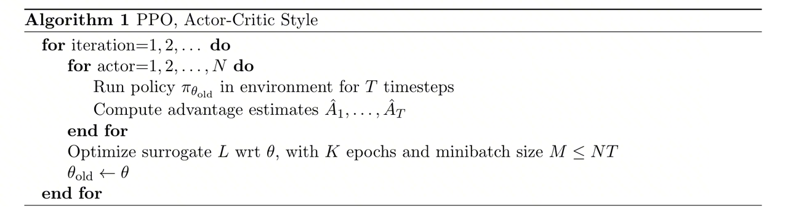
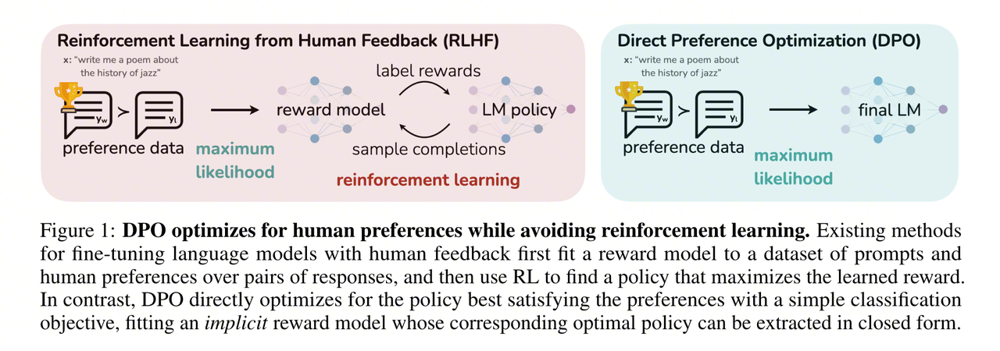
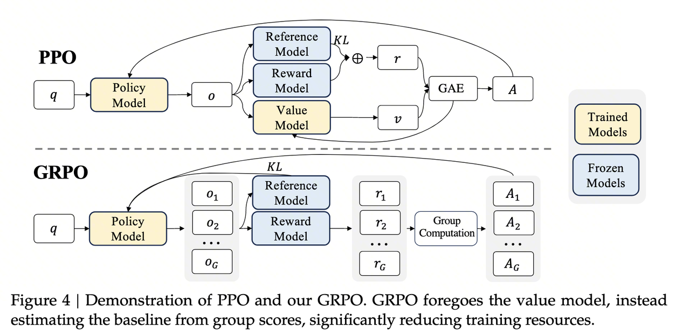
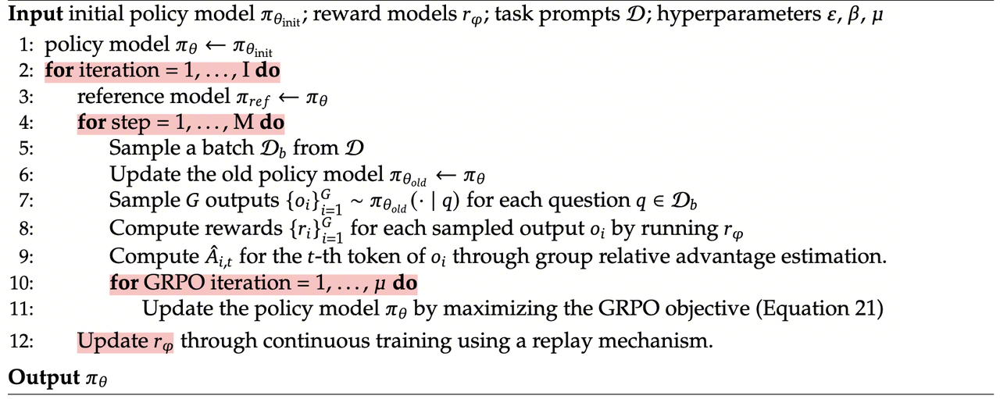

> **TL;DR**：在大语言模型（LLM）的对齐（Alignment）领域，强化学习扮演着核心角色。从 OpenAI 提出的 PPO，到斯坦福大学提出的 DPO，再到 DeepSeek 提出的 GRPO，每一代算法都在解决前一代的痛点。本文将从原理、公式推导到工程实现，系统梳理这三大算法的核心思想与演进逻辑，帮助读者建立完整的技术图谱。

***

# 1、PPO：强化学习对齐的奠基石

## 1.1 背景与动机

[Proximal Policy Optimization（PPO）](https://arxiv.org/abs/1707.06347)最初由 Schulman 等人于 2017 年提出，*旨在简化 TRPO（Trust Region Policy Optimization）的复杂实现 —— 用简单的 Clip 机制替代二阶 KL 约束，在保持策略更新稳定性的同时，允许对同一批数据进行多轮复用，从而提升样本效率*。在 LLM 对齐场景中，PPO 被用于 RLHF（Reinforcement Learning from Human Feedback）流程的核心训练阶段——在已经通过 SFT（Supervised Fine-Tuning）和奖励模型（Reward Model）训练后，利用 RL 进一步优化模型以对齐人类偏好。
PPO 的核心思想是：**在更新策略时，限制新策略与旧策略之间的偏离程度**，从而在提升性能的同时保证训练稳定性。

## 1.2 PPO 目标函数：从全局视角出发

理解 PPO，最好的方式是**从它的****目标函数****开始，自顶向下地层层剥开**。与其一上来就陷入具体的技术细节，不如先看清全貌——PPO 到底在优化什么？然后我们再逐步深入，理解目标函数中每一个符号的来龙去脉。
PPO 的目标函数如下：$$\\mathcal{J}\_{PPO}(\\theta) = \\mathbb{E}\[q \\sim P(Q), o \\sim \\pi\_{\\theta\_{old}}(O|q)\] \\frac{1}{|o|} \\sum\_{t=1}^{|o|} \\min \\left\[ \\frac{\\pi\_\\theta(o\_t | q, o\_{
**逐项拆解**：

| 符号 | 含义 |
| --- | --- |
| $$q \\sim P(Q$$ | 从问题分布里采样一个问题/提示（prompt），例如一句用户指令。 |
| $$o \\sim \\pi\_{\\theta\_{old}}(O \\mid q$$ | 用旧策略生成一个完整输出序列 $$o = (o\_1, \\dots, o\_{|o|}$$ |
| $$|o$$ | 输出序列长度；前面的 $$\\frac{1}{|o|} \\sum\_{t=1}^{|o|$$ 是对**所有 token 取平均**，避免长回答在 loss 上权重更大。 |
| $$\\pi\_\\theta(o\_t \\mid q, o\_{ | 当前待更新策略 $$\\pi\_\\thet$$ 在前缀 $$(q, o\_{ 下生成第 $$$$ 个 token 是 $$o\_$$ 的概率。 |
| $$\\pi\_{\\theta\_{\\text{old}}}(o\_t \\mid q, o\_{ | 旧策略下的对应概率，用来构造**重要性采样****比率**： |\
|| $$r\_t(\\theta) = \\frac{\\pi\_\\theta(o\_t \\mid q, o\_{ |
| $$A\_$$ | 第 $$$$ 个 token 的 **advantage（优势函数）**，一般由 GAE 计算：$$A\_t \\approx (\\text{"当前路径未来回报"}) - (\\text{价值网络给出的 baseline})$$ |
| $$\\varepsilo$$ | PPO 的 clip 超参数，典型值 $$0.1 \\sim 0.$$ |

第一次看到这个公式，不用慌。我们先从直觉上理解它在做什么——**在所有采样的 token 上，计算「新策略相比旧策略的改进幅度」与「优势值」的乘积，同时用 clip 机制防止步子迈得太大。** 
这个公式里有三个关键组件：

1. **重要性采样****比率** $$r\_t(\\theta) = \\frac{\\pi\_\\theta}{\\pi\_{\\theta\_{old}}$$：衡量新旧策略的差异
	
2. **优势函数** $$A\_$$：衡量这一步动作比「平均水平」好了多少
	

- $$A\_t > $$：这一步比平均表现更好，应该增加对应动作概率
	
- $$A\_t < $$：这一步比平均表现差，应该减小该动作概率
	

3. **Clip 机制**：给更新幅度加上「安全带」，$$\\text{clip}(r\_t, 1 - \\varepsilon, 1 + \\varepsilon$$ 把比率 $$r\_t(\\theta$$ 截断在区间 $$\[1 - \\varepsilon, 1 + \\varepsilon$$ 内，防止一次更新动得太狠，保证训练稳定，这样能限制单步更新幅度，避免策略离旧策略太远。
	

- 当 $$A\_t > $$（想鼓励这一动作）时，$$r\_$$ 不允许大于 $$1 + \\varepsilo$$，否则取被截断的版本
	
- 当 $$A\_t < $$（想惩罚这一动作）时，$$r\_$$ 不允许小于 $$1 - \\varepsilo$$
	

4. **Clip机制与****重要性采样****比率**$$r\_t(\\theta) = \\frac{\\pi\_\\theta(o\_t \\mid q, o\_{**的配合**
	

**PPO** **和下文中的****GRPO****的每一项都是用****重要性采样****比率来放大/缩小采样出的logprob** **梯度****，再通过** **clipping** **限制更新幅度，这是****RL****的核心。** 
其中，$$A\_$$（优势函数）是整个公式的灵魂——它决定了每个 token 的更新方向和力度。那么 $$A\_$$ 到底是怎么算出来的？这就需要我们层层深入。接下来，我们先看数据是怎么采样的，然后再详细推导 $$A\_$$ 的计算过程。

## 1.3 数据采样与 $A\_t$ 计算

### 1.3.1 采样轨迹（只用 old policy）

首先，用旧策略 $$\\pi\_{\\theta\_{old}}$$ 采样一条完整输出：
$$o = (o\_1, \\cdots, o\_T) \\sim \\pi\_{\\theta\_{old}}(O|q)$$
然后，用 Reward Model 对整条输出打分，结合 KL 惩罚得到每一步的奖励分数：
$$r\_{t}=r\_{\\varphi}(q,o\_{
这里的 KL 惩罚项确保模型不会为了追求高奖励而生成与参考模型差异过大的文本。

### 1.3.2 用 GAE 从 reward + value 得到优势 $$A\_t$$

有了每一步的奖励 $$r\_t$$，接下来需要回答一个问题：**这一步的动作到底比「平均水平」好了多少？** 这就是优势函数 $$A\_t$$ 要衡量的。
要算 $$A\_t$$，光有奖励不够——我们还需要一个「平均水平」的参照物。这个参照物就是状态价值函数 $$V(s\_t)$$，它由一个专门的 **Critic 网络（也叫 Value Network）** 负责输出。简单来说：

- **Reward Model**：给完整回答打分，提供即时奖励信号 $$r\_t$$（在 RL 阶段冻结不更新）
	
- **Critic 网络**：预测从当前位置到序列结束的**期望累积回报** $$V(s\_t) = \\mathbb{E}\[G\_t \\mid s\_t\]$$，作为计算 Advantage 的 baseline（与 Actor 同步训练）
	

> 在本节中，我们先**假设 Critic 已经训好**、能给出合理的 $$V(s\_t)$$，专注于理解 $$A\_t$$ 的计算逻辑。至于 Critic 本身是怎么训练的，我们在 1.4 节详细展开。

在强化学习中，状态价值 $$V(s\_t)$$ 的直观含义是：**从现在开始，直到序列结束，我能拿到的所有奖励的折扣总和**。
$$V(s\_t) \\approx r\_t + \\gamma r\_{t+1} + \\gamma^2 r\_{t+2} + \\dots$$
利用数学上的递归关系，我们可以把它写成：
$$V(s\_t) \\approx \\underbrace{r\_t}\_{\\text{眼前的钱}} + \\underbrace{\\gamma V(s\_{t+1})}\_{\\text{未来的钱}}$$
**第一步：计算 TD Error（时序差分误差** $$\\delta\_t$$**）**
$$\\delta\_t = r\_t + \\gamma V(s\_{t+1}) - V(s\_t)$$
各项含义：
\- $$r\_t$$：当前这一步获得的即时奖励（通常是 KL 惩罚，最后一步才有大分）
\- $$V(s\_t)$$：**Critic 认为**当前状态值多少分
\- $$V(s\_{t+1})$$：走到下一步后，**Critic 认为**那个新状态值多少分
\- $$\\gamma$$：折扣因子（比如 0.99），表示未来的分不如现在的分值钱
**直观理解**：如果 $$\\delta\_t > 0$$，说明 $$r\_t + \\gamma V(s\_{t+1})$$（现实情况）比 $$V(s\_t)$$（Critic 的预期）要高，说明这一步走得超出预期的好。
**第二步：计算** **GAE** **优势** $$\\hat{A}\_t$$
TD Error 只看了一步，眼光太短浅。GAE 把当前这一步的误差，加上未来的误差（打折后）累加起来：
$$\\hat{A}\_t = \\delta\_t + (\\gamma \\lambda)\\delta\_{t+1} + (\\gamma \\lambda)^2 \\delta\_{t+2} + \\cdots + (\\gamma \\lambda)^{T-t} \\delta\_T$$
$$\\lambda$$：这是 GAE 特有的参数（比如 0.95），用于平衡方差和偏差
\- **含义**：当前这一步的优势，不仅取决于这一步走得好不好（ $$\\delta\_t$$），还取决于它是否让后面几步也容易走好
**PPO** **的 Advantage 一句话总结**：
$$\\text{Advantage} = \\text{加权累加的 (现实 - 预期)}$$

### 1.3.3 计算每个位置的「真实回报」

**目标公式**： $$\\text{Target}\_t = V(s\_t) + \\hat{A}\_t$$
这个公式看起来简单，但其背后蕴含着深刻的数学意义。下面我们来详细推导。
**准备公式**：
回顾两个核心定义：
\- TD Error ( $$\\delta\_t$$)： $$\\delta\_t = r\_t + \\gamma V(s\_{t+1}) - V(s\_t)$$
\- GAE ( $$\\hat{A}\_t$$)： $$\\hat{A}\_t = \\sum\_{k=0}^{\\infty} (\\gamma \\lambda)^k \\delta\_{t+k} = \\delta\_t + (\\gamma\\lambda)\\delta\_{t+1} + (\\gamma\\lambda)^2\\delta\_{t+2} + \\dots$$
**展开推导**：
我们把 $$\\text{Target}\_t = V(s\_t) + \\hat{A}\_t$$ 展开。为了看清规律，我们只写前两项，看看它是怎么「消消乐」的，但又是怎么「消不干净」的。
$$\\begin{aligned} \\text{Target}\_t &= \\mathbf{V(s\_t)} \\\\ &+ \\underbrace{(r\_t + \\gamma V(s\_{t+1}) - \\mathbf{V(s\_t)})}\_{\\delta\_t} \\\\ &+ (\\gamma\\lambda) \\underbrace{(r\_{t+1} + \\gamma V(s\_{t+2}) - V(s\_{t+1}))}\_{\\delta\_{t+1}} \\\\ &+ (\\gamma\\lambda)^2 \\delta\_{t+2} + \\dots \\end{aligned}$$
**第一步整理**：可以看到第一行的 $$V(s\_t)$$ 和第二行的 $$-V(s\_t)$$ 完美抵消了。剩下：
$$\\text{Target}\_t = r\_t + \\gamma V(s\_{t+1}) + (\\gamma\\lambda)(r\_{t+1} + \\gamma V(s\_{t+2}) - V(s\_{t+1})) + \\dots$$
**第二步关键整理（观察** $$V(s\_{t+1})$$**）**：
我们把含有 $$V(s\_{t+1})$$ 的项提取出来。一项是前面的 $$\\gamma V(s\_{t+1})$$，一项是后面的 $$-(\\gamma\\lambda) V(s\_{t+1})$$。
$$\\gamma V(s\_{t+1}) - \\gamma\\lambda V(s\_{t+1}) = \\gamma (1-\\lambda) V(s\_{t+1})$$
于是公式变成了：
$$\\begin{aligned} \\text{Target}\_t &= r\_t + \\gamma (1-\\lambda)V\_{t+1} \\\\ &+ \\gamma\\lambda r\_{t+1} + (\\gamma\\lambda) \\gamma (1-\\lambda)V\_{t+2} \\\\ &+ (\\gamma\\lambda)^2 \\left\[ r\_{t+2} + \\gamma (1-\\lambda)V\_{t+3} + \\dots \\right\] \\end{aligned}$$
**最终的「一般形式」**：如果你不断这样递归下去，会发现一个惊人的规律——
$$G\_t^\\lambda = (1-\\lambda) \\sum\_{n=1}^{\\infty} \\lambda^{n-1} G\_t^{(n)}$$
这里的 $$G\_t^{(n)}$$ 代表 n-step Return（看 $$n$$ 步真实奖励，后面用预测）：
\- $$n=1$$： $$G\_t^{(1)} = r\_t + \\gamma V(s\_{t+1})$$（只看 1 步）
\- $$n=2$$： $$G\_t^{(2)} = r\_t + \\gamma r\_{t+1} + \\gamma^2 V(s\_{t+2})$$（看 2 步）
\- $$n=\\infty$$： $$G\_t^{(\\infty)} = G\_t$$（Monte Carlo，全看真实）
**推导结论**：利用 $$V\_{old} + A$$ 构造出来的 Target，本质上是**所有可能的 n 步回报的加权平均值**！权重由 $$\\lambda$$ 决定——越大，越重视长远的真实奖励；越小，越重视近期的预测。

> **GAE** **的智慧（** $$\\lambda = 0.95$$**）**
> 构造 $$\\text{Target} = V\_{old} + A$$ 是为了取其精华，去其糟粕。$\\lambda=0.95$ 时，它相当于在说：「我 95% 相信现实发生的事（后面的 $r$），但也保留 5% 对 Critic 预测的信任（用来平滑噪音）。」
> \- 通过引入 $$V$$（预测）：我们削减了 $$G\_t$$ 中因为环境随机性带来的巨大方差
> \- 通过引入 $$r$$（现实）：我们修正了 $$V$$ 可能会有的偏差

其中 $$\\gamma$$ 是折扣因子（通常接近 1）， $$r\_t$$ 是第 $$t$$ 步获得的奖励。
$$G\_t = V\_{old} + A$$构造的是 $$\\lambda-Return$$：

- 如果 $$\\lambda = 1$$，由于数学上的抵消，它就退化为蒙特卡洛回报 $G\_t$
	
- 如果 $$\\lambda < 1$$，它是 $$G\_t$$ 的一个低方差近似版。我们故意用这个公式，是为了让 Critic 学得更稳，而不是完全照搬某一次采样的 $$G\_t$$
	

**小结与展望**：回顾一下，整个 $$A\_t$$ 的计算链条是：
$$\\text{RM 打分} \\xrightarrow{r\_t} \\text{结合 Critic 的 } V(s\_t) \\xrightarrow{\\text{GAE}} \\hat{A}\_t$$
在这个链条中，**Critic 提供的** $$V(s\_t)$$ **质量直接决定了** $$A\_t$$ **的准确性**——如果 Critic 预测得不准，Advantage 的信噪比就会很差，Actor 的更新方向也会跟着跑偏。所以一个自然的问题是：**Critic 网络本身是怎么训练的？它的训练目标是什么？** 这正是下一节要回答的问题。

## 1.4 训练 Critic 网络

在 1.3 节中，Critic 提供的 $$V(s\_t)$$ 贯穿了整个 Advantage 计算过程。现在我们来看它自身是怎么训练的。
**Critic 的架构**：在 LLM-RLHF 的典型实现中，Critic 与 Actor **共享同一个 Transformer backbone**，在最后一层额外接一个**线性头**（将 hidden state 映射到标量）。在每个时间步 $$t$$，Critic 利用当前状态 $$s\_t$$（即 prompt + 已生成序列 $$o\_{ 经过 Transformer 编码后的隐藏表示）输出 $$V(s\_t)$$，其训练目标是**回归拟合从该位置出发的期望累积回报**。
Value Network 的训练目标是：
$$\\min\_{V} \\mathbb{E}\_{s\_t, R} \\left\[ (V(s\_t) - R)^2 \\right\]$$
这是一个标准的 MSE 回归问题，我们想找到最优函数 $$V^\*(s\_t)$$。
设模型在某一状态 $$s\_t$$上预测为 $$v$$，真实未来回报是随机变量 $$R$$，则目标变成：
$$\\min\_{v} \\mathbb{E}\[(v - R)^2\]$$
对 $$v$$ 求导：
$$\\frac{d}{dv} \\mathbb{E}\[(v - R)^2\] = 2\\mathbb{E}\[v - R\] = 0$$
解得：
$$v = \\mathbb{E}\[R\]$$
因此，最优 $V(s\_t)$ 不是某次 $R$，也不是逼近 $R$ 的趋势曲线，而是： $$V(s\_t) = \\mathbb{E}\[R \\mid s\_t\]$$

> **关键洞察**： $$V(s\_t)$$ 是对未来累积回报的**条件期望**——一个预测基线，而不是 reward 的逐步逼近值。它不是试图越来越接近某一次具体的 reward，而是**根据当前 state 估计「平均而言，未来还能拿多少分」**。这正是它能作为 1.3 节中 Advantage 基线的数学根基。

## 1.5 PPO 训练流程

综上，PPO 的训练分为三个清晰的阶段
**第一步：采样与打分（Rollout）**
此时我们有旧的策略网络（Actor）和旧的价值网络（Critic）。

1. 让 Actor 去环境里跑（比如生成文本），拿到状态 $$$$、动作 $$$$、奖励 $$$$
	
2. 用旧的 Critic 对这些状态打分，得到 $$V\_{old}(s$$
	

**第二步：计算优势和目标（Calculation）—— 关键步骤**
在这个阶段，网络是**不更新**的。我们利用刚才收集的数据计算出两个**固定的****张量**：

1. **计算 Advantage (**$$\\hat{A$$**)**：利用 $$$$ 和 $$V\_{old$$，套用 GAE 公式算出优势
	
2. **计算 Returns (Target)**：直接用公式 $$\\text{Returns} = V\_{old} + \\hat{A$$
	

> **注意**：这一步做完后，$$\\hat{A$$ 和 $$\\text{Returns$$ 就变成了**常数**（不再带有计算图的梯度），也就是我们常说的 label。

**第三步：训练更新（Optimization）**
现在的输入数据是：$$(s, a, \\hat{A}, \\text{Returns}$$。
进入 PPO 的 Update Loop（通常会循环几次）：

- **Actor 的任务**：利用第二步算好的 $$\\hat{A$$ 来计算 PPO 的 Policy Loss（那个截断的 CLIP 公式），更新 Actor 参数 $$L^{CLIP}(\\theta) \\approx \\min(\\dots) \\cdot \\hat{A$$
	
- **Critic 的任务**：利用第二步算好的 $$\\text{Returns$$ 作为真值（GT），更新 Critic 参数 $$L^{Value}(\\phi) = (V\_\\phi(s) - \\text{Returns})^$$
	

**为什么要这样？**
因为 PPO 是 **On-Policy（同策略）** 算法。Advantage 的含义是："在当时那个时刻，采取这个动作比平均水平好了多少"。这个"平均水平"（基线）必须是采样时的那个 Critic 给出的。如果你先更新了 Critic，基线变了，那么你之前算的 Advantage 就没意义了（偏差会变大），数学上就不成立了。
**总结流程图**：

1. 旧 Critic → 算出 Advantage 和 Returns
	
2. 锁定这两个值（当作固定数字）
	
3. Advantage → 用来训练 Actor
	
4. Returns → 用来训练新 Critic
	

***

# 2、DPO：绕过 RL 的优雅捷径

## 2.1 核心思想与主要发现

在 PPO 的框架中，我们需要先训练一个 Reward Model 对回复打分，再用 RL 算法（配合 Critic 网络）去最大化这个打分。整个流程链条很长：训练 RM → RM 打分 → 计算 Advantage → 更新 Actor → 同步更新 Critic。DPO（Direct Preference Optimization）的核心洞察是：

> *能不能跳过 Reward Model 和* *RL* *过程，直接从人类偏好数据中优化策略？*

答案是可以的。[DPO（Direct Preference Optimization）](https://arxiv.org/abs/2305.18290)由 Rafailov 等人于 2023 年在 NeurIPS 上提出，其核心洞察是：**语言模型****本身就隐含地扮演了****奖励模型****的角色**，我们可以跳过显式的奖励建模和 RL 训练。其主要发现可以概括为两步：

1. **KL 约束下的最优策略存在闭式解**——从 RLHF 的优化目标出发，可以推导出一个显式的 $$\\pi^\*(y|x$$ 表达式；
	
2. **将这个闭式解代入 Bradley-Terry 偏好模型**，就能把"学习 Reward → 再做 RL"的两阶段流程，简化为一个直接在偏好数据上训练策略的分类损失。
	

下面我们沿着这个思路，逐步推导 DPO 的理论基础。

### 2.1.1 从 KL 约束优化到最优策略的闭式解

RLHF 的核心优化目标是：在最大化期望奖励的同时，不让策略偏离参考策略 $$\\pi\_{\\text{ref}$$ 太远（用 KL 散度约束）：
$$\\max\_{\\pi\_\\theta} \\; \\mathbb{E}\_{x \\sim \\mathcal{D},\\, y \\sim \\pi\_\\theta(\\cdot|x)} \\left\[ r(x, y) \\right\] - \\beta \\, \\text{KL}\\!\\left\[\\pi\_\\theta(\\cdot|x) \\;\\|\\; \\pi\_{\\text{ref}}(\\cdot|x)\\right\]$$
其中 $$r(x, y$$ 是 Reward Model 给出的奖励， $$\\beta$$ 控制 KL 惩罚强度。
对于这个 KL 约束优化问题，可以用变分法推导出其最优策略的闭式解：
$$\\pi^\*(y|x) = \\frac{1}{Z(x)} \\, \\pi\_{\\text{ref}}(y|x) \\, \\exp\\!\\left(\\frac{r(x,y)}{\\beta}\\right)$$
 

其中 $$Z(x) = \\sum\_y \\pi\_{\\text{ref}}(y|x) \\exp\\!\\left(\\frac{r(x,y)}{\\beta}\\right$$ 是归一化常数（配分函数），确保 $$\\pi^$$ 仍然是合法的概率分布。

> **直觉**：最优策略在参考策略的基础上，按奖励大小做指数级的"re-weighting"——奖励越高的回复概率越大，但受到 $$\\bet$$ 的约束不会偏离太远。

### 2.1.2 反解出隐式奖励函数

上面的闭式解建立了"奖励 → 最优策略"的映射，但 DPO 需要的是反方向：**从策略反推出奖励**。对闭式解取对数并移项，可以得到：
$$r(x, y) = \\beta \\log \\frac{\\pi^\*(y|x)}{\\pi\_{\\text{ref}}(y|x)} + \\beta \\log Z(x)$$
这就是 DPO 的关键等式——**奖励可以完全用策略的****对数****概率比来表示，即最优模型生成某个回答的概率，正比于初始模型生成该回答的概率乘以一个由****奖励函数****决定的指数项。** 注意 $$\\beta \\log Z(x$$ 只依赖于 prompt $$x$$，与具体回复 $$$$ 无关。

### 2.1.3 代入 Bradley-Terry 模型，消去配分函数

人类偏好通常建模为 Bradley-Terry 模型：给定 prompt $$$$ 和一对回复 $$(y\_w, y\_l)$$，人类更偏好 $$y\_$$ 的概率为：
$$p(y\_w \\succ y\_l | x) = \\sigma\\!\\left(r(x, y\_w) - r(x, y\_l)\\right)$$
其中 $$\\sigm$$ 是 sigmoid 函数。将 2.1.2 中的隐式奖励代入：
$$p(y\_w \\succ y\_l | x) = \\sigma\\!\\left(\\beta \\log \\frac{\\pi^\*(y\_w|x)}{\\pi\_{\\text{ref}}(y\_w|x)} - \\beta \\log \\frac{\\pi^\*(y\_l|x)}{\\pi\_{\\text{ref}}(y\_l|x)}\\right)$$
注意发生了什么：$$\\beta \\log Z(x$$ **在做差时完美消去了**。这意味着我们不需要计算那个难以处理的配分函数，偏好概率完全由策略与参考策略的对数概率比决定。
这一步至关重要——正是配分函数的消去，使得 DPO 可以绕过 Reward Model 的显式训练，直接在偏好数据上优化策略。下一节，我们将基于这个结果写出 DPO 的训练损失函数。

## 2.2 DPO 损失函数

有了上面的推导，DPO 的损失函数就水到渠成了。将 2.1.3 中的偏好概率取负对数似然，就得到 DPO 的训练目标：
$$\\mathcal{L}\_{\\text{DPO}}(\\theta) = -\\mathbb{E}\_{(x, y\_w, y\_l) \\sim \\mathcal{D}} \\left\[ \\log \\sigma\\!\\left( \\beta \\log \\frac{\\pi\_\\theta(y\_w|x)}{\\pi\_{\\text{ref}}(y\_w|x)} - \\beta \\log \\frac{\\pi\_\\theta(y\_l|x)}{\\pi\_{\\text{ref}}(y\_l|x)} \\right) \\right\]$$
这个损失函数的设计有三个精妙之处：
**1\. 隐式奖励差驱动优化**
定义隐式奖励为 $$\\hat{r}\_\\theta(x, y) = \\beta \\log \\frac{\\pi\_\\theta(y|x)}{\\pi\_{\\text{ref}}(y|x)}$$，则损失可以简写为：
$$\\mathcal{L}\_{\\text{DPO}} = -\\mathbb{E}\\left\[\\log \\sigma\\!\\left(\\hat{r}\_\\theta(x, y\_w) - \\hat{r}\_\\theta(x, y\_l)\\right)\\right\]$$
优化方向很清晰：**拉大好回复与坏回复之间的隐式奖励差**。
**2\.** **梯度****自带难度感知**
对 $$\\mathcal{L}\_{\\text{DPO}$$ 求梯度，可以得到：
$$\\nabla\_\\theta \\mathcal{L}\_{\\text{DPO}} = -\\beta \\, \\mathbb{E}\\!\\left\[\\underbrace{\\sigma\\!\\left(\\hat{r}\_\\theta(x, y\_l) - \\hat{r}\_\\theta(x, y\_w)\\right)}\_{\\text{隐式权重}} \\left\[\\nabla\_\\theta \\log \\pi\_\\theta(y\_w|x) - \\nabla\_\\theta \\log \\pi\_\\theta(y\_l|x)\\right\]\\right\]$$
其中的隐式权重 $$\\sigma(\\hat{r}\_\\theta(x, y\_l) - \\hat{r}\_\\theta(x, y\_w)$$ 起到了自适应采样的作用：当模型**已经能正确区分好坏回复**（隐式奖励差大），这个权重趋近于 0，梯度很小；当模型**判断错误**（给坏回复的隐式奖励更高），权重趋近于 1，产生强烈的纠正梯度。这意味着 DPO 天然会把学习资源集中在"难样本"上。
**3\. 仅依赖策略概率，无需额外模型**
整个损失只涉及 $$\\pi\_\\thet$$ 和 $$\\pi\_{\\text{ref}$$ 的对数概率——不需要 Reward Model 打分，不需要 Critic 网络，不需要 GAE 计算。训练时只需做一次前向传播计算 log-prob 即可。
至此，我们已经看到了 DPO 损失函数的完整形态。但一个自然的问题是：**PPO** **中需要显式的 KL 散度惩罚来防止策略崩塌，DPO 的损失里没有出现任何 KL 项——它是如何保持策略稳定性的？** 下一节将回答这个问题。

## 2.3 KL 散度惩罚的隐式机制

DPO 的损失函数中看不到显式的 KL 惩罚项，但这并不意味着 KL 约束不存在——它以两种方式隐含在损失设计中。

### 2.3.1 隐式奖励本身就是 KL 的"局部梯度"

回顾隐式奖励的定义：
$$\\hat{r}\_\\theta(x, y) = \\beta \\log \\frac{\\pi\_\\theta(y|x)}{\\pi\_{\\text{ref}}(y|x)}$$
这个对数比值正是 KL 散度 $$\\text{KL}\[\\pi\_\\theta \\| \\pi\_{\\text{ref}}$$ 在点 $$$$ 上的"局部贡献"。当策略 $$\\pi\_\\thet$$ 偏离参考策略时，这个值会增大，而 DPO 的梯度权重 $$\\sigma(\\hat{r}\_\\theta(y\_l) - \\hat{r}\_\\theta(y\_w)$$ 会自动调节：

- **Case 1：策略大幅偏离参考策略**。此时 $$\\hat{r}\_\\thet$$ 的绝对值很大，如果偏离方向正确（好回复的隐式奖励 >> 坏回复），sigmoid 趋近 0，梯度被抑制——**防止策略继续偏离**。
	
- **Case 2：策略接近参考策略**。 $$\\hat{r}\_\\theta$$ 较小，sigmoid 接近 0.5，梯度正常更新——**允许策略在参考策略附近自由探索**。
	

### 2.3.2 约束来源：闭式解的推导前提

更根本地说，DPO 损失的推导起点就是 KL 约束优化问题（2.1.1）。整个损失函数是在 **"最优策略满足 KL 约束"这一前提下** 推导出来的，因此 KL 约束已经被"编码"进了损失的数学结构中：

- $$\\bet$$ 参数直接控制约束强度：$\\beta$ 越大，隐式奖励对策略偏离越敏感，等价于更强的 KL 惩罚；
	
- 参考策略 $$\\pi\_{\\text{ref}$$ 的对数概率始终作为"锚点"出现在损失中，任何偏离都会被自动计入优化目标。
	

> **小结**：DPO 并非"没有 KL 约束"，而是将 KL 约束从 PPO 的显式惩罚项，转化为了损失函数的内在数学结构。这种设计更优雅，但也意味着 $$\\bet$$ 的调参更为关键——它是唯一控制探索-利用平衡的旋钮。

## 2.4 DPO 相对于 PPO 的改进与效果

理解了 DPO 的理论基础和隐式约束机制后，我们可以系统地比较它与 PPO 的差异。下表总结了两者在训练流程、模型需求和优化特性上的关键区别：

| 改进点 (Improvement Area) | PPO (传统RLHF方法) | DPO (直接偏好优化) | 带来的效果改善 (Resulting Improvement) |
| :-: | :-: | :-: | :-: |
| 1\. 训练流程 (Training Pipeline) | 复杂的三阶段流程：1. 监督微调 (SFT) 2. 训练奖励模型 (RM) 3. PPO强化学习微调 | 简化的两阶段流程：1. 监督微调 (SFT) 2. DPO直接优化 | 极大简化了流程，降低了工程复杂度和出错可能。不再需要维护和调试一个独立的奖励模型。 |
| 2\. 奖励机制 (Reward Mechanism) | 显式的奖励模型：需要训练一个独立的神经网络来拟合人类偏好，给生成的文本打分。这个模型是真实奖励的一个代理（Proxy）。 | 隐式的奖励模型：不需要独立的奖励模型。奖励函数通过r ∝ log(π\_θ / π\_ref)被解析地、隐式地定义在策略模型本身。 | 消除了奖励模型和策略模型可能存在的不一致性（mismatch）。同时，由于奖励和策略是联动的，有效避免了奖励过度优化（reward hacking）的风险，即模型找到奖励模型的漏洞获得高分，但实际质量很差。 |
| 3\. 优化算法 (Optimization Algorithm) | 复杂的Actor-Critic算法：PPO需要维护一个策略网络（Actor）和一个价值网络（Critic），通过复杂的优势函数（Advantage Estimation）来计算梯度，方差较大。 | 简单的分类损失函数：DPO将问题转化为一个简单的二元交叉熵损失，这是一个非常成熟和稳定的监督学习问题，可以直接通过梯度下降优化。 | 训练过程更稳定、收敛更快。由于是直接优化，其方差更低，结果的可复现性更强。不再需要复杂的价值函数估计。 |
| 4\. 训练过程中的采样 (Sampling During Training) | 需要在训练中动态采样：PPO的训练循环中，需要不断从当前策略模型（Actor）中采样生成新的回答，然后用奖励模型打分，计算优势值。这是一个主要的计算瓶颈。 | 无需在训练循环中采样：DPO的训练完全基于静态的、离线的偏好数据集 (prompt, y\_w, y\_l) 进行。 | 训练速度大幅提升，计算资源需求显著降低。这使得DPO在同等硬件条件下可以更快地完成训练，或者用更少的资源完成训练。 |
| 5\. 超参数调优 (Hyperparameter Tuning) | 超参数众多且敏感：需要仔细调整Actor和Critic的学习率、折扣因子gamma、GAE的lambda、PPO的clipping epsilon、KL散度惩罚系数等，调优非常困难。 | 超参数少且鲁棒：最关键的超参数只有一个 β，它直接控制KL散度的强度，并且其含义清晰，调优相对简单得多。 | 调参难度大大降低，更容易获得好结果。这极大地降低了研究者和开发者应用偏好对齐技术的门槛。 |
| 6\. 稳定性和实现难度 (Stability & Implementation Complexity) | 实现复杂，训练不稳定：PPO的实现涉及多个组件和复杂的计算流程，代码容易出错。RL训练过程本身也可能非常不稳定。 | 实现简单，训练过程稳健：DPO损失函数的实现非常直接（在PyTorch中可能只需几行代码），整个训练过程就像普通的监督学习一样稳定。 | 更可靠，更容易部署和维护。简单性和稳定性使得这项关键的对齐技术能够被更广泛地应用和研究。 |

DPO 的优势可以概括为三点：

1. **流程大幅简化**：去掉了 RM 训练和 RL 采样循环，将对齐训练简化为一个标准的监督学习过程（偏好对上的二分类）；
	
2. **资源开销降低**：从 4 个模型缩减到 2 个，显存需求和工程复杂度显著下降；
	
3. **训练更稳定**：消除了 RM 质量传导误差、Critic 网络训练不稳定、以及 on-policy 采样方差等不稳定因素。
	

当然，DPO 也有其局限性：它依赖离线偏好数据的质量和覆盖度，无法像 PPO 那样通过在线采样持续探索新的回复空间。这一局限后来催生了如 Online DPO、IPO 等改进工作。
 

在下一章中，我们将介绍 GRPO——它从另一个角度简化 PPO：**保留** **RL** **框架但去掉 Critic 网络**，用组内归一化的方式直接估计优势函数。

# 3、GRPO：无 Critic 的群体智慧

## 3.1 背景与动机：去掉 Critic，还能做 RL 吗？

在前两章中，我们看到了两条通往对齐的路径：

- **PPO**：完整的 RL 框架，效果强大但链条很长——需要 RM 打分、Critic 估值、GAE 计算、重要性采样与 Clip，同时维护 4 个模型；
	
- **DPO**：彻底绕过 RL，用偏好数据直接优化策略，流程极简但放弃了在线采样的探索能力。
	

有没有一条中间路线——**保留** **RL** **的在线采样优势，但去掉最沉重的 Critic 网络**？
[Group Relative Policy Optimization（GRPO）](https://arxiv.org/abs/2402.03300)正是这个思路的产物。它由 DeepSeek 团队在 2024 年的 DeepSeekMath 论文中提出，核心创新只有一句话：

> **用"同一道题的多个回答之间的相对比较"来替代 Critic 网络的价值估计。** 

这带来两个直接好处：

1. **节省****显存**：不再需要与策略模型同等规模的 Critic 网络（对于 67B 的模型，这意味着省下近一半的显存）。
	
2. **简化流程**：省去了 Critic 的训练、更新和同步维护，同时避免了 Critic 估值不准导致的训练不稳定。
	

那么问题来了：PPO 中 Critic 的核心作用是提供基线（baseline）来降低梯度方差，去掉它之后，GRPO 如何计算优势函数 $$\\hat{A}\_{i,t}$$？这正是下一节要回答的问题。

## 3.2 Advantage 计算：GRPO 的核心创新

回顾 PPO 中优势函数的计算链条：**RM** **打分 →** $$r\_$$ **→ 结合 Critic 的** $$V(s\_t$$ **→ TD Error →** **GAE** **→** $$\\hat{A}\_$$。GRPO 的做法是把中间涉及 Critic 的部分全部替换掉——不再问"这个回答比 Critic 预测的好多少"，而是问"**这个回答在同一组回答中排第几**"。
具体来说，GRPO 对同一个问题 $$$$ 从旧策略 $$\\pi\_{\\theta\_{\\text{old}}$$ 采样 $$$$ 个完整回答 $$o\_1, o\_2, \\dots, o\_G$$（例如同一道数学题生成 16 种解法），然后根据监督信号的粒度，分为两种计算方式。

### 3.2.1 结果监督（Outcome Supervision）：整条序列共享一个优势

当使用 Reward Model 对每个回答给出一个整体标量分数时，计算分两步：
**第一步：组内标准化（Group Normalization）**
用 RM 分别对 $$$$ 个回答打分，得到 $$r\_1, r\_2, \\dots, r\_G$$，然后做标准化处理：
$$\\tilde{r}\_i = \\frac{r\_i - \\text{mean}(\\mathbf{r})}{\\text{std}(\\mathbf{r})}$$
标准化之后， $$\\tilde{r}\_i > 0$$ 意味着"比组内平均水平好"， $$\\tilde{r}\_i < 0$$ 意味着"比平均水平差"。这就是"相对比较"的含义——奖励信号不再是绝对值，而是相对于同组其他回答的排位。
**第二步：优势广播（Broadcasting）**
由于 RM 只给出整条回答的最终得分，没有逐 token 的细粒度信号，GRPO 采用最简单的策略——"**一人得道，鸡犬升天**"：序列中每个 token 的优势值都等于该序列的归一化得分：
$$\\hat{A}\_{i,t} = \\tilde{r}\_i \\quad (\\text{对于序列 } i \\text{ 中的所有位置 } t)$$

> **直觉**：如果一道题的某个解法最终答对了（$\\tilde{r}\_i$ 大），那么这个解法中的每一步推理都被视为"好的"，统一给予正向激励。这是一个粗粒度的近似，但实践中对数学推理任务效果很好。

### 3.2.2 过程监督（Process Supervision）：逐步累积优势

当使用 Process Reward Model（PRM）对每个推理步骤分别打分时，优势的计算可以更加精细：
**第一步：步骤级标准化（Step-wise Normalization）**
GRPO 收集组内所有回答的所有步骤奖励，计算全局均值和标准差进行标准化：
$$\\tilde{r}\_{i,j} = \\frac{r\_{i,j} - \\text{mean}(\\text{GroupRewards})}{\\text{std}(\\text{GroupRewards})}$$
其中 $$r\_{i,j$$ 是第 $$$$ 个回答中第 $$$$ 个步骤的奖励。
**第二步：计算累积优势（Accumulated Future Return）**
与结果监督不同，过程监督下每一步都有独立的评分。此时 GRPO 借鉴了强化学习中"回报"（Return）的思想——当前步骤的优势不仅取决于自身得分，还要对后续所有步骤的表现负责：
$$\\hat{A}\_{i,t} = \\sum\_{k=j}^{K\_i} \\tilde{r}\_{i,k} \\quad (\\text{其中 token } t \\text{ 属于第 } j \\text{ 个步骤})$$
这意味着：早期的推理步骤（如"设 $$$$ 为…"）承担了更大的优势权重，因为它们影响了后续所有步骤的方向。如果后续推理全部正确，早期步骤会获得最高的正向激励；反之，如果在某一步开始出错，该步骤及之前的步骤都会受到惩罚。

> **小结**：无论是结果监督还是过程监督，GRPO 的核心思想一致——**用组内统计量替代 Critic 的价值估计**。组均值充当了 PPO 中 Critic 的"基线"角色，标准差起到了方差归一化的作用。有了优势函数 $\\hat{A}\_{i,t}$，接下来就可以写出 GRPO 的目标函数了。

***

## 3.3 GRPO 目标函数

GRPO 的目标函数在形式上与 PPO 高度相似——同样使用重要性采样比率和 Clip 机制，但在两个关键位置做了修改：
$$\\mathcal{J}\_{GRPO}(\\theta) = \\mathbb{E}\[q \\sim P(Q), \\{o\_i\\}\_{i=1}^{G} \\sim \\pi\_{\\theta\_{old}}(O|q)\]=\\frac{1}{G} \\sum\_{i=1}^{G} \\frac{1}{|o\_i|} \\sum\_{t=1}^{|o\_i|} \\left\\{ \\min \\left\[ \\frac{\\pi\_\\theta(o\_{i,t} | q, o\_{i,
其中 $$\\rho\_{i,t} = \\frac{\\pi\_\\theta(o\_{i,t} | q, o\_{i, 是重要性采样比率。
与 PPO 逐一对比，可以清晰看出 GRPO 的两处结构性变化：

### 3.3.1 变化一：多样本"组"采样与双层平均

PPO 对单个 prompt 生成**一条**回复，在 token 维度计算优势并更新；GRPO 则对同一个问题生成 $$$$ 条回复，形成一个"组"：

- **外层** $$\\frac{1}{G}\\sum\_{i=1}^{G}$$：对 $$$$ 个回答求平均——这是 GRPO 特有的，PPO 中没有这一层；
	
- **内层** $$\\frac{1}{|o\_i|}\\sum\_{t=1}^{|o\_i|}$$：对单条回答中的 token 求平均——这与 PPO 相同，做长度归一化。
	

多样本采样不仅是优势计算的基础（需要组内统计量），还天然提供了更低方差的梯度估计：$G$ 个样本的平均梯度比单样本梯度稳定得多。

### 3.3.2 变化二：优势函数来源完全不同

|  | PPO | GRPO |
| --- | --- | --- |
| **优势来源** | Critic 网络 $$V(s\_t$$ + GAE | 组内奖励标准化 |
| **所需额外模型** | Critic（与 Actor 同规模） | 无 |
| **粒度** | 逐 token（通过 TD Error 链式传播） | 结果监督：全序列统一；过程监督：逐步累积 |

其余结构——重要性采样比率 $$\\rho\_{i,t}$$、Clip 机制、KL 散度惩罚——与 PPO 完全一致。直觉上，GRPO 的优化动力可以用一句话概括：

- 组内表现高于平均的回答（ $$\\hat{A}\_{i,t} > 0$$）→ 整条序列的生成概率被**放大**；
	
- 组内表现低于平均的回答（ $$\\hat{A}\_{i,t} < 0$$）→ 整条序列的生成概率被**压制**。
	

这就完成了不依赖 Critic 网络的策略优化。接下来，我们看看这个目标函数在实际训练中是如何迭代执行的。

***

## 3.4 GRPO 训练流程

### 3.4.1 算法流程详解：三层嵌套循环

GRPO 的训练由三层嵌套循环构成，每一层承担不同的职责：
**第一层：大周期（Iteration Loop）——** $$$$ **轮**
这是迭代式强化学习的宏观周期。每轮开始时执行两个关键操作：

- **更新****参考模型**：将当前策略 $$\\pi\_\\thet$$ 复制为 $$\\pi\_{\\text{ref}}$$。此后在整个大周期内， $$\\pi\_{\\text{ref}}$$ 保持冻结，用于计算 KL 散度惩罚；
	
- **更新** **RM**（可选）：DeepSeekMath 的特色设计——边训策略边优化奖励模型 $$r\_\\phi$$，形成"裁判与选手共同进步"的迭代。
	

**第二层：采样周期（Step Loop）——** $$$$ **步**
这是数据收集阶段，每步执行以下操作：

1. **抽题**：从题库中采样一批问题 $$\\mathcal{D}\_b$$；
	
2. **快照**：将当前 $$\\pi\_\\thet$$ 复制给 $$\\pi\_{\\theta\_{\\text{old}}}$$，作为本轮采样的冻结副本；
	
3. **组****采样**：用 $$\\pi\_{\\theta\_{\\text{old}}$$ 对每个问题生成 $$$$ 个回答；
	
4. **打分与计算优势**：用 RM/PRM 打分，按 3.2 节的方法计算 $\\hat{A}\_{i,t}$；
	
5. **产出**：得到一批固定的训练数据——包含问题、回答、优势值、以及旧策略的概率 $$\\pi\_{\\theta\_{\\text{old}}}(o\_{i,t}|q, o\_{i,。
	

**第三层：学习周期（****GRPO** **Loop）——** $$\\m$$ **轮**
拿着第二层采好的固定数据，对策略模型进行 $$\\m$$ 轮参数更新。数据会被切成 mini-batch，逐批计算 3.3 节的目标函数并执行梯度下降。

> **为什么要分三层？** 第一层控制"参考锚点的刷新频率"，第二层控制"数据采集与模型快照的节奏"，第三层控制"对同一批数据的复用程度"。三个频率解耦，使得训练的稳定性和数据效率都可以独立调节。

### 3.4.2 重要性采样比率（Ratio）为什么必不可少？

在第三层循环中，存在一个核心矛盾：**数据是用** $$\\pi\_{\\theta\_{\\text{old}}$$ **生成的，但模型** $$\\pi\_\\thet$$ **在每次****梯度****更新后都在变化**。从第一个 mini-batch 更新后， $$\\pi\_\\theta$$ 就已经不等于 $$\\pi\_{\\theta\_{\\text{old}}$$ 了；到第 $$\\m$$ 轮结束时，两者可能相差甚远。
重要性采样比率 $$\\rho\_{i,t} = \\frac{\\pi\_\\theta(o\_{i,t}|q, o\_{i, 正是为了修正这个"分布错位"：

| Ratio 取值 | 含义 | 对训练的影响 |
| --- | --- | --- |
| $$\\rho > $$ | 新策略比旧策略更倾向于生成这个 token | 若 $\\hat{A} > 0$（好回答），放大梯度，强化该行为 |
| $$\\rho < $$ | 新策略认为这个 token 不太可能出现 | 降低该数据点的权重，减少其对更新的影响 |
| $$\\rho \\approx $$ | 新旧策略一致 | 无修正，正常更新 |

Clip 机制则在 Ratio 的基础上再加一道保险：将 $$\\rho\_{i,t$$ 截断在 $$\[1{-}\\varepsilon, 1{+}\\varepsilon$$ 范围内，防止任何单个 token 的梯度贡献过大，确保策略更新始终在旧策略的"信任域"内。

> **一句话总结**：Ratio 解决的是"用旧经验训练新模型"的分布不一致问题（off-policy correction），Clip 限制的是"新模型一次能跑多远"的更新幅度——两者配合，保障了多轮复用数据时的训练稳定性。这一机制与 PPO 完全相同，是 GRPO "保留 RL 框架"的直接体现。

## 3.5 三大算法对比总览

从 PPO 到 DPO 再到 GRPO，三种算法代表了大模型对齐技术的三条不同路径：完整 RL、去 RL 化、以及轻量 RL。下表从多个维度系统对比三者的设计选择与工程特性：
 

| 对比维度 | PPO（完整 RL 框架） | DPO（直接偏好优化） | GRPO（轻量 RL 框架） | 关键差异说明 |
| --- | --- | --- | --- | --- |
| **1\. 训练流程** | 复杂的三阶段流程：1. 监督微调（SFT）→ 2. 训练奖励模型（RM）→ 3. PPO 强化学习微调 | 简化的两阶段流程：1. 监督微调（SFT）→ 2. DPO 直接优化 | 与 PPO 相同的三阶段流程，但第三阶段的 RL 过程大幅简化（无需 Critic 训练） | DPO 省去了独立 RM 训练阶段；GRPO 保留 RM 但简化了 RL 内部流程 |
| **2\. 奖励机制** | **显式****奖励模型**：需训练独立的 RM 神经网络，对生成文本打分。RM 是真实奖励的代理（Proxy） | **隐式****奖励模型**：不需要独立 RM，奖励通过 $$r \\propto \\log(\\pi\_\\theta / \\pi\_{\\text{ref}}$$ 被解析地、隐式地定义在策略模型本身中 | **显式****奖励模型**：与 PPO 相同需要独立 RM；支持结果监督（ORM）和过程监督（PRM）两种打分粒度 | DPO 将奖励和策略联动，消除了 RM 与策略之间的不一致性（mismatch），但也失去了独立评估回复质量的能力 |
| **3\. 优化算法** | **Actor-Critic 架构**：需同时维护策略网络（Actor）和价值网络（Critic），通过 GAE 计算优势函数，梯度方差较大 | **分类****损失函数**：将问题转化为偏好对上的二元交叉熵损失，本质是监督学习问题，可直接通过梯度下降优化 | **Group Relative 架构**：只保留 Actor，去掉 Critic，用组内奖励标准化替代 GAE 来估计优势函数 | GRPO 在 PPO 和 DPO 之间取得折中——保留了 RL 的策略梯度框架，但用统计方法替代了最重的 Critic 组件 |
| **4\. 训练****采样** | **在线****采样**：需要在训练循环中不断从当前策略中采样生成回答，再用 RM 打分、计算优势值，是主要的计算瓶颈 | **无需在线****采样**：训练完全基于静态的、离线的偏好数据集 $(x, y\_w, y\_l)$，与标准监督学习流程一致 | **在线组****采样**：对同一问题从旧策略采样 $$$$ 个回答（如 16/64 个），组内比较后构造优势信号 | DPO 的离线特性大幅降低了计算需求；GRPO 虽需在线采样但多样本策略天然降低了梯度方差 |
| **5\. 所需模型** | **4 个模型**：Actor + Critic + RM + Reference，显存占用极高 | **2 个模型**：Policy + Reference，显存需求最低 | **3 个模型**：Actor + RM + Reference（无 Critic），显存介于两者之间 | 对于 70B 参数量的模型，去掉 Critic 可节省约 30-50% 的显存开销 |
| **6\. 超参调优** | **超参众多且敏感**：Actor/Critic 学习率、GAE 的 $\\lambda$、clip 的 $\\varepsilon$、KL 惩罚系数 $$\\bet$$ 等，调参难度高 | **超参少且****鲁棒**：核心超参仅 $\\beta$（控制 KL 约束强度），含义清晰，调优相对简单 | **超参适中**：继承 PPO 的 clip $$\\varepsilo$$ 和 KL 系数 $\\beta$，新增组大小 $G$，但省去了 Critic 相关超参 | DPO 的低调参门槛使其更易被研究者和开发者采用；GRPO 的 $$$$ 选择对性能有显著影响 |
| **7\. KL 约束** | **显式惩罚项**：在目标函数中直接添加 $$\\beta \\cdot \\text{KL}\[\\pi\_\\theta | \\pi\_{\\text{ref}}$$ | **隐式约束**：KL 惩罚被编码在损失函数的数学结构中，通过 $$\\log(\\pi\_\\theta/\\pi\_{\\text{ref}}$$ 自动实现 | **显式惩罚项**：与 PPO 相同，在目标函数中直接计算 KL 散度 | DPO 的隐式约束更优雅，但也使得 $$\\bet$$ 的调参更为关键——它是唯一的稳定性旋钮 |
| **8\. 稳定性与实现复杂度** | 实现复杂，训练不稳定：涉及多组件协同（RM 质量传导误差、Critic 估值偏差、on-policy 采样方差），RL 训练本身也容易不稳定 | 实现简单，训练稳健：损失函数实现只需几行代码，整个训练过程就像普通的监督学习一样稳定 | 实现中等，训练较稳定：保留了 PPO 的采样和 clip 机制，但去掉 Critic 后消除了一个主要的不稳定源 | GRPO 的组内标准化天然提供了低方差的优势估计，弥补了去掉 Critic 带来的精度损失 |
| **9\. 适用场景** | 通用 RLHF：适合需要精细奖励信号和在线探索的场景 | 有偏好数据时的快速对齐：适合离线数据充足、追求训练效率的场景 | 可验证奖励的推理任务：特别适合数学、代码等有明确正误判定的场景 | 三者并非替代关系，而是适配不同的资源条件和任务特性 |
| **10\. 代表应用** | InstructGPT, ChatGPT | Llama 2, Zephyr | DeepSeekMath, DeepSeek-R1 | — |

 